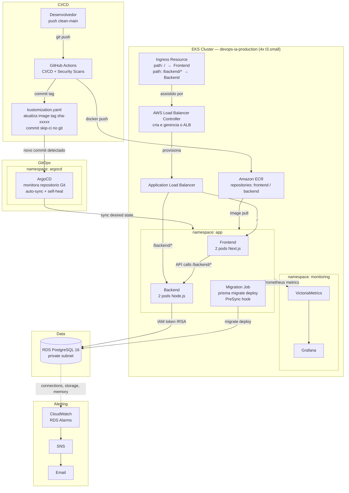

# Cloud Native Platform on AWS

### Terraform, EKS, GitOps, DevSecOps, RDS IAM Auth, Observabilidade e Incident Response

## Overview

Plataforma cloud native executando na AWS com aplicação real em produção (Incident Tracker). Objetivo: demonstrar práticas utilizadas em ambientes enterprise.

- Terraform para provisionamento de infraestrutura em camadas independentes
- EKS para orquestração de containers com segurança de pod (non-root, readOnly filesystem)
- GitHub Actions para CI/CD autenticado via OIDC, sem credenciais estáticas
- ArgoCD para GitOps — o pipeline atualiza o git, o ArgoCD converge o cluster
- RDS PostgreSQL com IAM Authentication via IRSA, sem senha estática em lugar nenhum
- VictoriaMetrics e Grafana para observabilidade, CloudWatch para alertas de banco
- Simulação de 4 incidentes reais com ciclo completo de detecção, resolução e MTTR documentado

## Stack

| Camada | Tecnologia |
|---|---|
| Compute | Amazon EKS 1.31 (4 worker nodes t3.small, Amazon Linux 2023) |
| Infraestrutura | Terraform (5 stacks independentes, state no S3) |
| CI/CD | GitHub Actions + OIDC (sem credenciais estáticas) |
| GitOps | ArgoCD com auto-sync e self-heal |
| Backend | Node.js 20 + Express + TypeScript + Prisma ORM |
| Frontend | Next.js 14 + Tailwind CSS |
| Banco | RDS PostgreSQL 16, IAM auth via IRSA (sem senha estática) |
| Observabilidade | VictoriaMetrics + Grafana + CloudWatch alarms + SNS |
| Segurança de pipeline | Gitleaks, Checkov, Semgrep, Trivy (10 jobs de scan) |
| Segurança de workload | non-root, readOnlyRootFilesystem, drop ALL capabilities, IRSA |

## AI-Assisted Operations

Este projeto foi desenvolvido com Claude Code usando agentes especializados e skills reutilizáveis para acelerar e estruturar o trabalho de plataforma.

**Agentes** com papéis bem definidos e restrições claras:
- Arquiteto de soluções: planeja, avalia trade-offs e produz ADRs (nunca escreve código)
- DevOps Engineer: implementa IaC a partir dos ADRs aprovados
- Engenheiro DevSecOps: revisa código, Terraform e pipelines antes de qualquer commit
- Especialista RDS: cobre banco, IRSA, migrations e runbooks de incidente

**Skills** reutilizáveis para operações de plataforma:
- Diagnóstico de aplicação vs diagnóstico de infraestrutura (escopos separados)
- Simulação de incidentes com ciclo SRE completo
- Rebuild de infraestrutura do zero com todos os passos manuais documentados

O diferencial não é usar IA para gerar código: e ter criado um processo estruturado onde cada agente tem responsabilidade única, entregáveis definidos e restrições explicitas.

- [docs/agents/](docs/agents/README.md)
- [docs/skills/](docs/skills/README.md)

## Aplicação

**Incident Tracker** — sistema real de gerenciamento de incidentes com autenticação JWT, dashboard e histórico.


## Arquitetura



## Infraestrutura


## Observabilidade


## Pipeline


## CloudWatch e Alertas


## Incident Response em Produção

4 incidentes simulados em ambiente real com ciclo SRE completo: detecção via alerta no Grafana, resolução com runbook e MTTR documentado.

| Incidente | Tipo | Severidade | Impacto | MTTR |
|---|---|---|---|---|
| INC-004 | Imagem inválida (ErrImagePull) | Aviso | Zero downtime, maxUnavailable:0 protegeu o servico | 6 min |
| INC-003 | Secret ausente (ContainerConfigError) | Aviso | Zero downtime, pods antigos continuaram servindo | 5 min |
| INC-002 | OOMKilled (container sem memória) | Crítico | Pod em CrashLoop, sem impacto em produção | 4 min |
| INC-001 | RDS indisponível (rds_iam revogado) | Crítico | 503 total, readinessProbe bloqueou o ALB | 4 min |

**INC-004 (Aviso)**


**INC-002 (Crítico)**


**INC-001 (Crítico)**


Para reproduzir os incidentes com alertas reais no Grafana: ver [docs/incidents/](docs/incidents/).

## Acesso rápido

```bash
# Grafana (Platform Alerts dashboard e a home)
kubectl port-forward svc/vm-grafana -n monitoring 3000:80
# http://localhost:3000

# ArgoCD
kubectl port-forward svc/argocd-server -n argocd 8080:443
# https://localhost:8080

# ALB endpoint
kubectl get ingress devops-ia -n app -o jsonpath='{.status.loadBalancer.ingress[0].hostname}'
```

## Documentação

| Documento | Conteudo |
|---|---|
| [docs/setup/](docs/setup/README.md) | Passo a passo para recriar o ambiente do zero |
| [docs/architecture/](docs/architecture/overview.md) | Stacks Terraform, IRSA, pipelines, segurança, ADRs |
| [docs/incidents/](docs/incidents/) | Incidentes simulados com timeline e MTTR real |
| [docs/runbooks/](docs/runbooks/) | Runbooks operacionais para falhas conhecidas |
| [docs/agents/](docs/agents/README.md) | Agentes especializados e suas responsabilidades |
| [docs/skills/](docs/skills/README.md) | Skills operacionais e mapa de uso |

## Roadmap

- Loki + Grafana Alloy: agregação de logs dos pods
- Tempo: distributed tracing com OpenTelemetry
- Alertmanager: routing de alertas Kubernetes
- External Secrets Operator: integração com AWS Secrets Manager
