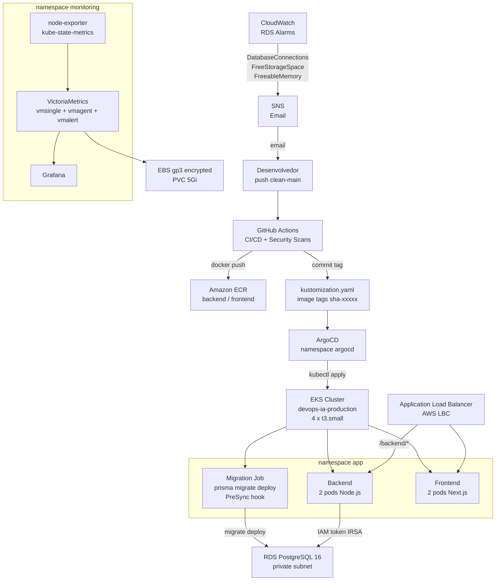

# DevOps/SRE Platform on AWS: EKS + Terraform + GitOps

Plataforma DevOps/SRE de portfólio completa na AWS, com uma aplicação real (Incident Tracker) rodando em produção. O projeto demonstra práticas que se usam em ambientes reais: infraestrutura como código em camadas independentes com Terraform, pipeline CI/CD autenticado via OIDC sem credenciais fixas, entrega contínua por GitOps com ArgoCD, banco de dados RDS com autenticação IAM via IRSA (sem senha estática), e observabilidade com VictoriaMetrics e Grafana.

> Screenshots devem ser adicionados manualmente em `docs/architecture/screenshots/`.

## Aplicacao

**Incident Tracker** — sistema de gerenciamento de incidentes com autenticação JWT, criação e acompanhamento de incidentes, painel de controle e histórico. Interface web completa, não é um placeholder.

| Componente | Tecnologia |
|---|---|
| Backend | Node.js 20 + Express + TypeScript + Prisma ORM |
| Frontend | Next.js 14 + Tailwind CSS |
| Banco de dados | RDS PostgreSQL 16, db.t3.micro |
| Autenticação no banco | IAM Database Auth via IRSA (token efêmero 15 min, sem senha estática) |
| Namespace Kubernetes | `app` |

## Arquitetura



## Acesso rapido

| Servico | Endereco |
|---|---|
| Aplicacao (ALB) | `http://k8s-app-devopsia-a05a05588d-34662498.us-east-1.elb.amazonaws.com` |
| Grafana (port-forward) | `http://localhost:3000` |
| ArgoCD (port-forward) | `https://localhost:8443` |

```bash
# Grafana
kubectl port-forward -n monitoring svc/victoria-metrics-grafana 3000:80

# ArgoCD
kubectl port-forward -n argocd svc/argocd-server 8443:443
```

Credenciais do Grafana estao no Secret `grafana-admin-secret` (namespace `monitoring`):

```bash
kubectl get secret -n monitoring grafana-admin-secret \
  -o jsonpath='{.data.admin-password}' | base64 -d
```

## Estrutura do repositorio

```
devops-ia-terraform/
  00-remote-backend-stack-ai/    S3 state + DynamoDB lock
  01-networking-stack-ai/        VPC, subnets, NAT Gateway, Flow Logs
  02-eks-stack-ai/               Cluster EKS 1.31, Node Group t3.small, ECR, acesso
  03-ci-cd-stack-ai/             OIDC Provider GitHub + IAM Role para o CI
  04-addons-stack-ai/            metrics-server, AWS LBC, EBS CSI Driver (IRSA)
  05-database-stack-ai/          RDS PostgreSQL 16, IRSA backend, SG, CloudWatch alarms

devops-ia-kubernetes/
  backend/                       ServiceAccount, ConfigMap, Deployment, Service, PDB, Migration Job
  frontend/                      Deployment, Service, PDB
  storage/                       StorageClass gp3 (default do cluster)
  monitoring/                    Helm values da VictoriaMetrics k8s stack
  ingress.yaml                   ALB Ingress: / frontend, /backend/* backend
  kustomization.yaml             GitOps root: recursos + image tags
  argocd-application.yaml        ArgoCD Application (aplicado uma vez no bootstrap)
  monitoring-application.yaml    ArgoCD Application de monitoramento

devops-ia-apps/
  backend/                       Node.js + Express + TypeScript + Prisma
    src/lib/prisma.ts              Cliente Prisma com IAM token refresh proativo
    prisma/migrations/             Migrations versionadas (baseline 0_init)
    prisma/schema.prisma           Schema Prisma
  frontend/
    devops-ia-platform/            Next.js 14 + Tailwind CSS

.github/workflows/
  ci-cd.yml                      Build, push ECR, atualiza kustomization
  security-scans.yml             Gitleaks, Checkov, Semgrep, npm audit, Trivy (em cada push)
  security-scheduled.yml         Varredura diaria 06:00 UTC

docs/
  ADR-XXXX-*.md                  Architecture Decision Records
  implementation/                Registros de implementacao
  runbooks/                      Runbooks operacionais
```

## Stacks Terraform

Cada stack e um diretorio independente com seu proprio state remoto no S3. Aplicadas em sequencia porque dependem umas das outras via `terraform_remote_state`. Nenhuma stack usa modulos comunitarios — apenas recursos nativos do provider `hashicorp/aws`.

### Stack 00: Remote Backend

Cria o bucket S3 (`devops-ia-production-terraform-state-<account-id>`) e a tabela DynamoDB para lock de state. Aplicada uma vez, nunca destruida. Todas as demais stacks apontam para este backend.

### Stack 01: Networking

VPC multi-AZ (`vpc-06aecd0164074155b`, CIDR `/16`) com 3 subnets publicas e 3 subnets privadas distribuidas em `us-east-1a/b/c`, NAT Gateway (single, custo reduzido para portfolio), Internet Gateway, route tables separadas por tier e VPC Flow Logs habilitados.

Subnets publicas recebem a tag `kubernetes.io/role/elb = "1"` para que o AWS Load Balancer Controller consiga fazer auto-descoberta e criar o ALB nas subnets corretas. Nodes EKS ficam nas subnets privadas.

### Stack 02: EKS

Cluster `devops-ia-production` (Kubernetes 1.31) com Managed Node Group de 4 instancias `t3.small` (AMI `AL2023_x86_64_STANDARD`), distribuidos em 3 AZs. Inclui:

- OIDC Provider do cluster (base para IRSA)
- ECR repositories: `devops-ia/production/backend` e `devops-ia/production/frontend`
- Access entry para o usuario IAM do operador
- Security groups do plano de controle e dos nodes
- Launch template com configuracao de kubelet (`maxPods: 110` com prefix delegation no VPC CNI)

### Stack 03: CI/CD (OIDC)

Registra o GitHub como OIDC Identity Provider na conta AWS e cria a IAM Role `devops-ia-production-github-actions`. A trust policy restringe a assuncao da role a tokens gerados especificamente por este repositorio — sem nenhuma credencial estatica armazenada.

A role tem permissoes de push para o ECR e de leitura/escrita no `kustomization.yaml` via git commit.

### Stack 04: Addons

Instala no cluster (via Terraform + Helm/addon gerenciado):

- **metrics-server**: expoe metricas de CPU/memoria dos pods para `kubectl top` e HPA
- **AWS Load Balancer Controller**: cria e gerencia ALBs a partir de recursos `Ingress` do Kubernetes, com IRSA propria (`devops-ia-production-ebs-csi` para o EBS CSI, role separada para o LBC)
- **EBS CSI Driver** (addon gerenciado `aws-ebs-csi-driver` v1.60.1): habilita provisionamento dinamico de PersistentVolumes EBS; exige IRSA `devops-ia-production-ebs-csi`
- **StorageClass `gp3`**: criada como default do cluster, gp3 encrypted, provisionada pelo EBS CSI Driver

### Stack 05: Database

RDS PostgreSQL 16 (`db.t3.micro`, single-AZ, armazenamento 20 GB gp2) com:

- Subnet group em subnets privadas (banco nunca exposto publicamente)
- Security group permitindo porta 5432 apenas do SG dos nodes EKS
- Parameter group customizado: `rds.force_ssl = 1` (TLS obrigatorio)
- IAM Database Authentication habilitada
- IRSA `devops-ia-production-backend-irsa` para o ServiceAccount `backend` (namespace `app`)
- CloudWatch alarms: `DatabaseConnections > 80`, `FreeStorageSpace < 5 GB`, `FreeableMemory < 64 MB`
- SNS topic com subscricao por email para alertas

## Autenticacao IAM no banco (IRSA)

O backend nao usa senha de banco. O fluxo completo:

1. O pod do backend tem o ServiceAccount `backend` anotado com `eks.amazonaws.com/role-arn: arn:aws:iam::<account-id>:role/devops-ia-production-backend-irsa`
2. O EKS injeta um token OIDC no pod via `automountServiceAccountToken: true`
3. `src/lib/prisma.ts` usa `@aws-sdk/rds-signer` para gerar um token IAM assinado (SigV4) valido por 15 minutos
4. O Prisma conecta ao banco com `postgresql://app_user:<token>@<host>:5432/devops_ia?sslmode=require`
5. Um timer faz refresh proativo do token 2 minutos antes do vencimento, sem interromper conexoes em andamento

O usuario `app_user` tem `GRANT rds_iam` no PostgreSQL. O acesso e auditado via CloudTrail (eventos `rds-db:connect`).

## Pipeline CI/CD

Arquivo: `.github/workflows/ci-cd.yml`

**Trigger**: push em `clean-main` com mudancas em `devops-ia-apps/**`

| Job | O que faz |
|---|---|
| `detect-changes` | Usa `dorny/paths-filter` para detectar quais apps mudaram e setar flags `backend` e `frontend` |
| `build-backend` | Autentica na AWS via OIDC (sem credenciais fixas), `docker build` do backend Node.js, push para o ECR com tag `sha-<7 chars do commit>` |
| `build-frontend` | Mesma sequencia para o Next.js 14 |
| `update-kustomization` | Atualiza as tags de imagem no `kustomization.yaml`, commita de volta com `[skip ci]`. O ArgoCD detecta a mudanca e sincroniza o cluster. |

O job `update-kustomization` so roda se pelo menos um dos builds teve sucesso, e e idempotente: se nao houver mudanca no arquivo, o commit e ignorado.

## Pipeline de segurança

Arquivo: `.github/workflows/security-scans.yml`

**Trigger**: push em `clean-main` e qualquer PR aberto contra `clean-main`

Todos os jobs fazem upload de resultados em formato SARIF para o GitHub Code Scanning (aba Security do repositorio).

| Job | Ferramenta | O que verifica | Criterio de bloqueio |
|---|---|---|---|
| `secret-scan` | Gitleaks | Historio de commits buscando tokens, chaves e senhas expostos | Qualquer achado bloqueia |
| `iac-tf-scan` | Checkov | Arquivos `.tf`: buckets sem criptografia, SG abertos, logs desabilitados | CRITICAL bloqueia |
| `iac-k8s-scan` | Checkov | Manifestos Kubernetes: root, sem readOnlyRootFilesystem, sem resource limits | CRITICAL bloqueia |
| `sast-frontend` | Semgrep | TypeScript/Next.js com OWASP Top 10 e ruleset TypeScript | Findings viram anotacoes no PR |
| `sast-backend` | Semgrep | Node.js/TypeScript com OWASP Top 10, TypeScript e Node.js rulesets | Findings viram anotacoes no PR |
| `sca-frontend` | npm audit + Trivy fs | Dependencias npm e filesystem do frontend | CRITICAL bloqueia, HIGH: warning (SLA 7 dias) |
| `sca-backend` | npm audit + Trivy fs | Dependencias npm e filesystem do backend | CRITICAL bloqueia, HIGH: warning (SLA 7 dias) |
| `container-frontend` | Trivy image | Imagem Docker do frontend (camadas OS + bibliotecas) | CRITICAL bloqueia |
| `container-backend` | Trivy image | Imagem Docker do backend | CRITICAL bloqueia |
| `summary` | -- | Consolida resultados no GitHub Step Summary | Sempre roda (`if: always()`) |

### Varredura diaria

Arquivo: `.github/workflows/security-scheduled.yml`

Roda todo dia as 06:00 UTC independente de commits. Detecta CVEs publicados apos o ultimo push (drift de vulnerabilidade). Jobs: Gitleaks, Trivy full repo scan, Checkov Terraform (com `soft_fail: true` — e auditoria, nao gate de merge).

## Kubernetes e GitOps

**Namespace de aplicacao**: `app`

O ArgoCD monitora a branch `clean-main`, path `devops-ia-kubernetes/`, com `automated: {prune: true, selfHeal: true}`. Qualquer commit nesse path vira realidade no cluster em ate 3 minutos (ou imediatamente apos `argocd app sync devops-ia`).

**Migration Job (PreSync hook)**: antes de cada sync do ArgoCD, um Kubernetes Job roda `npx prisma migrate deploy` usando a mesma imagem do backend. Se a migration falhar, o sync e abortado — o deploy nao prossegue com schema desatualizado. Migrations sao versionadas em `devops-ia-apps/backend/prisma/migrations/` (baseline `0_init` criada a partir do schema existente via `prisma migrate diff`).

Requisitos por Deployment (conforme `.claude/rules/kubernetes-manifests.md`):
- 2 replicas minimo
- `RollingUpdate` com `maxUnavailable: 0` (zero downtime)
- `readinessProbe` + `livenessProbe`
- `requests` + `limits` de CPU e memoria
- `podAntiAffinity` preferencial por `kubernetes.io/hostname` (replicas em nodes diferentes)
- `revisionHistoryLimit: 3`
- `runAsNonRoot: true`, `allowPrivilegeEscalation: false`, `readOnlyRootFilesystem: true`

## Observabilidade

**Stack**: VictoriaMetrics k8s stack (Helm), namespace `monitoring`, gerenciada pelo ArgoCD.

Escolha justificada no ADR-0007: VictoriaMetrics e mais leve em memoria que kube-prometheus-stack, o que faz diferenca em nodes `t3.small` com 2 GiB de RAM.

| Componente | Funcao |
|---|---|
| `vmsingle` | Armazena metricas (PVC gp3 5 Gi, encrypted) |
| `vmagent` | Scraping de metricas de pods, nodes e objetos Kubernetes |
| `vmalert` | Avaliacao de regras de alerta |
| `grafana` | Dashboards (datasource tipo Prometheus apontando para o vmsingle) |
| `kube-state-metrics` | Metricas de estado dos objetos Kubernetes |
| `node-exporter` | DaemonSet: metricas de hardware e SO dos nodes |

**Acesso ao Grafana**:

```bash
kubectl port-forward -n monitoring svc/victoria-metrics-grafana 3000:80
# http://localhost:3000
# Credenciais: kubectl get secret -n monitoring grafana-admin-secret -o jsonpath='{.data.admin-password}' | base64 -d
```

**CloudWatch alarms (RDS)**:

| Alarme | Threshold | Acao |
|---|---|---|
| `DatabaseConnections` | > 80 conexoes | SNS -> Email |
| `FreeStorageSpace` | < 5 GB | SNS -> Email |
| `FreeableMemory` | < 64 MB | SNS -> Email |

## Seguranca

| Componente | Metodo |
|---|---|
| Backend -> RDS | IAM Database Auth via IRSA (token SigV4 15 min) |
| GitHub Actions -> AWS | OIDC federation (sem credenciais estaticas) |
| EBS CSI Driver -> AWS | IRSA (`devops-ia-production-ebs-csi`) |
| Pods | `runAsNonRoot`, `readOnlyRootFilesystem`, drop ALL capabilities |
| Volumes EBS | gp3 encrypted |
| TLS no banco | `rds.force_ssl = 1` + `sslmode=require` na connection string |
| Secrets fora do Git | `backend-secrets` (jwt-secret), `grafana-admin-secret` — criados manualmente, nunca commitados |

## Agentes Claude Code

Quatro agentes especializados definidos em `.claude/agents/`, cada um com papel e permissoes distintas.

### `devops-solution-architect`

Planeja arquiteturas, produz ADRs (Architecture Decision Records) e documentacao tecnica. Nunca cria arquivos `.tf`, manifestos Kubernetes ou codigo de aplicacao. E invocado antes de qualquer implementacao para estruturar o problema, avaliar alternativas e registrar a decisao. Os ADRs produzidos por ele ficam em `docs/ADR-XXXX-*.md`.

### `devops-senior-engineer`

Le os ADRs aprovados pelo arquiteto e implementa a solucao em IaC (Terraform), manifestos Kubernetes ou configuracoes de pipeline. Segue rigorosamente as convencoes de nomenclatura e estrutura de arquivos definidas em `.claude/rules/`. Os registros de implementacao ficam em `docs/implementation/IMPL-ADR-XXXX-YYYY-MM-DD.md`.

### `devsecops-senior-engineer`

Revisa codigo, arquivos Terraform, manifestos Kubernetes, Dockerfiles e GitHub Actions buscando segredos expostos, credenciais estaticas e configuracoes perigosas. Deve ser invocado antes de qualquer commit ou push. Entrega um veredicto estruturado: `APPROVED` ou `BLOQUEADO` com lista de achados.

### `postgres-rds-db-senior`

Especialista no banco de dados RDS PostgreSQL. Cobre decisoes de arquitetura de banco, modulos Terraform para RDS, seguranca (sem acesso publico, sem segredos no Git), integracao com o backend via IRSA, observabilidade (CloudWatch alarms, metricas de conexao) e runbooks de incidente. E o dono das operacoes de dados como criacao de usuarios, grants e execucao de migrations manuais.

## Skills Claude Code

Skills operacionais em `.claude/skills/`:

| Skill | O que faz |
|---|---|
| `/terraform-deploy` | Deploy de stacks Terraform: `fmt` -> `validate` -> `plan` -> `apply -auto-approve` com `-var-file="envs/production.tfvars"` |
| `/dockerfile-generator` | Gera Dockerfiles otimizados: multi-stage, alpine, rootless, healthcheck |
| `/docker-push-ecr` | Build e push de imagens Docker para repositorios ECR |
| `/depoveiro` | Diagnostica saude do cluster EKS: pods travados, IP exhaustion, ArgoCD fora de sync, CNI errors |
| `/PlantonistaOps` | Runbook de plantao: Terraform state lock, node group travado, kubectl sem autenticacao, ArgoCD dex crash |

## Do zero ao ar

### Pre-requisitos

- AWS CLI configurada com permissoes para criar VPC, EKS, IAM, S3, ECR, RDS
- Terraform instalado (`~> 1.9`)
- kubectl instalado
- `aws eks update-kubeconfig` apos o cluster existir

### 1. Backend remoto

```bash
cd devops-ia-terraform/00-remote-backend-stack-ai
terraform init
terraform apply -var-file="envs/production.tfvars"
```

### 2. Rede

```bash
cd devops-ia-terraform/01-networking-stack-ai
terraform init
terraform apply -var-file="envs/production.tfvars"
```

### 3. EKS e ECR

```bash
cd devops-ia-terraform/02-eks-stack-ai
terraform init
terraform apply -var-file="envs/production.tfvars"

aws eks update-kubeconfig --name devops-ia-production --region us-east-1
kubectl get nodes
```

### 4. OIDC e IAM para o CI

```bash
cd devops-ia-terraform/03-ci-cd-stack-ai
terraform init
terraform apply -var-file="envs/production.tfvars"
```

No GitHub: configure a variable `AWS_ROLE_ARN` com o ARN retornado pelo output do Terraform.

### 5. Addons (metrics-server, AWS LBC, EBS CSI Driver)

```bash
cd devops-ia-terraform/04-addons-stack-ai
terraform init
terraform apply -var-file="envs/production.tfvars"

# Confirmar que o AWS LBC subiu
kubectl get pods -n kube-system -l app.kubernetes.io/name=aws-load-balancer-controller

# Confirmar StorageClass gp3 como default
kubectl get storageclass
```

### 6. Banco de dados RDS

```bash
cd devops-ia-terraform/05-database-stack-ai
terraform init
terraform apply -var-file="envs/production.tfvars"
```

Apos o apply: criar o usuario `app_user` no PostgreSQL (acesso via pod dentro do cluster, banco e privado):

```sql
CREATE USER app_user;
GRANT rds_iam TO app_user;
GRANT ALL ON SCHEMA public TO app_user;
GRANT ALL ON ALL TABLES IN SCHEMA public TO app_user;
ALTER DEFAULT PRIVILEGES IN SCHEMA public GRANT ALL ON TABLES TO app_user;
```

Registrar a baseline de migrations (executar de dentro do cluster):

```bash
npx prisma migrate resolve --applied 0_init
```

### 7. ArgoCD (bootstrap unico)

```bash
kubectl create namespace argocd
kubectl apply -n argocd -f \
  https://raw.githubusercontent.com/argoproj/argo-cd/v2.14.11/manifests/install.yaml

kubectl wait --for=condition=Ready pods --all -n argocd --timeout=300s

# Criar credencial de acesso ao repositorio privado
# (deploy key SSH read-only no GitHub, registrar via argocd repo add ou Secret argocd-repo-creds)

kubectl apply -f devops-ia-kubernetes/argocd-application.yaml
kubectl apply -f devops-ia-kubernetes/monitoring-application.yaml
```

Com `automated: {prune: true, selfHeal: true}` ligado, o ArgoCD sincroniza automaticamente apos o apply do Application.

### 8. Secrets manuais (fora do Git)

```bash
# JWT secret para o backend
kubectl create secret generic backend-secrets \
  --namespace app \
  --from-literal=jwt-secret=<valor-seguro>

# Senha do Grafana
kubectl create secret generic grafana-admin-secret \
  --namespace monitoring \
  --from-literal=admin-user=admin \
  --from-literal=admin-password=<senha-segura>
```

## Dados do ambiente

Os valores reais estao nos outputs do Terraform (`terraform output` em cada stack). Os ARNs e URIs abaixo usam `<account-id>` como placeholder — substitua pelo ID da sua conta ao reproduzir o ambiente.

| Item | Valor |
|---|---|
| Conta AWS | `<account-id>` |
| Regiao | `us-east-1` |
| Cluster EKS | `devops-ia-production` |
| ALB endpoint | `k8s-app-devopsia-a05a05588d-34662498.us-east-1.elb.amazonaws.com` |
| RDS endpoint | `<rds-endpoint>.us-east-1.rds.amazonaws.com:5432` |
| Banco | `devops_ia` |
| ECR backend | `<account-id>.dkr.ecr.us-east-1.amazonaws.com/devops-ia/production/backend` |
| ECR frontend | `<account-id>.dkr.ecr.us-east-1.amazonaws.com/devops-ia/production/frontend` |
| GitHub Actions role | `arn:aws:iam::<account-id>:role/devops-ia-production-github-actions` |
| Backend IRSA role | `arn:aws:iam::<account-id>:role/devops-ia-production-backend-irsa` |
| EBS CSI IRSA role | `arn:aws:iam::<account-id>:role/devops-ia-production-ebs-csi` |

## ADRs (Architecture Decision Records)

| ADR | Titulo | Status |
|---|---|---|
| ADR-0001 | VPC multi-AZ com subnets publicas e privadas | Accepted |
| ADR-0002 | Backend remoto S3 para o state do Terraform | Accepted |
| ADR-0003 | Cluster EKS e configuracao do node group | Accepted |
| ADR-0004 | OIDC Provider e IAM Role para GitHub Actions | Accepted |
| ADR-0005 | Pipeline CI/CD com GitHub Actions | Accepted |
| ADR-0006 | ArgoCD e padrao GitOps | Accepted |
| ADR-0007 | Observabilidade com VictoriaMetrics (free-tier) | Accepted |
| ADR-0008 | Centralizacao de logs com Loki | Proposed |
| ADR-0009 | Seguranca no pipeline com scans automatizados | Accepted |
| ADR-0010 | Estrategia de rollback e recovery | Accepted |
| ADR-0011 | Policies Kubernetes com Kyverno | Proposed |
| ADR-0012 | Estrategia de separacao de repositorios GitOps | Accepted |
| ADR-0013 | RDS PostgreSQL free-tier | Accepted |
| ADR-0014 | Conectividade EKS-RDS via IRSA (IAM Database Auth) | Accepted |
| ADR-0015 | Autenticacao JWT | Accepted |
| ADR-0016 | Database migrations com Prisma migrate deploy | Accepted |
| ADR-0017 | Observabilidade de app e RDS (CloudWatch alarms) | Accepted |
| ADR-0018 | Fase 1: fechar GitOps, IRSA runtime e migrations | Accepted |

## Problemas resolvidos (nao regredir)

Esta plataforma chegou ao estado atual por uma sequencia de intervencoes em situacoes reais. Os principais problemas encontrados e corrigidos:

**IP exhaustion no VPC CNI (t3.small)**: o limite de 9 IPs de pod por node e atingido quando ArgoCD, kube-system e os servicos da aplicacao se concentram no mesmo node. Sintoma: `ContainerCreating` com evento `failed to assign an IP address`. Solucao documentada na skill `/depoveiro` (cordon do node saturado, delete dos pods travados, uncordon).

**Namespace default para app**: toda a stack de aplicacao foi migrada do namespace `default` para o namespace `app`. O `ingress.yaml` tinha `namespace: default` hardcoded — removido. A trust policy do IRSA estava scopada a `default:backend` — corrigida para `app:backend`.

**IRSA sem senha estática**: o backend foi migrado de `DATABASE_URL` com senha do master para autenticacao IAM via `@aws-sdk/rds-signer`. O `prisma.ts` implementa geracao de token e refresh proativo a cada 13 minutos.

**Migrations deterministicas**: substituicao de `prisma db push --accept-data-loss` por `prisma migrate deploy` com baseline `0_init` criada a partir do schema existente via `prisma migrate diff`. O Job de migration e um PreSync hook do ArgoCD — migration falha aborta o sync.

**EBS CSI Driver ausente**: o addon gerenciado `aws-ebs-csi-driver` foi adicionado na stack 04 com IRSA propria. Antes da correcao, PVCs ficavam em `Pending` por falta de provisioner.

**StorageClass gp3 como default**: criada via manifesto em `devops-ia-kubernetes/storage/storageclass-gp3.yaml` com anotacao `storageclass.kubernetes.io/is-default-class: "true"`. O PVC do vmsingle usa gp3 encrypted.

**Rolling update travado por PDB**: PodDisruptionBudget com `minAvailable: 1` bloqueava drenagem de node quando as duas replicas estavam no mesmo node. Corrigido com `podAntiAffinity` preferencial por hostname, garantindo distribuicao entre nodes.

**Grafana OOMKilled**: o Grafana 13 nao ficava estavel com 384 MiB de limite. Ajustado para 512 MiB nos values do chart.
