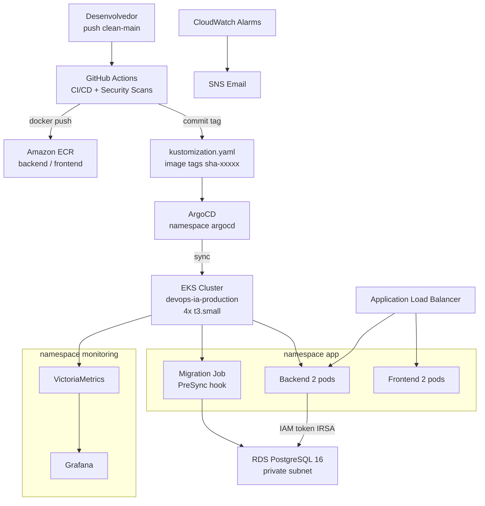

# Cloud Native Platform on AWS

### Terraform, EKS, GitOps, DevSecOps, RDS IAM Auth, Observabilidade e Incident Response

Plataforma cloud native de portfolio na AWS com aplicacao real em producao. Demonstra praticas de ambientes enterprise: IaC em camadas com Terraform, CI/CD via OIDC sem credenciais fixas, GitOps com ArgoCD, autenticacao IAM no banco via IRSA, observabilidade com VictoriaMetrics e Grafana, e simulacao de incidentes com ciclo SRE completo.

## Stack

| Camada | Tecnologia |
|---|---|
| Compute | EKS 1.31, 4x t3.small, AL2023 |
| Infraestrutura | Terraform (5 stacks independentes, state no S3) |
| CI/CD | GitHub Actions + OIDC (sem credenciais estaticas) |
| GitOps | ArgoCD com auto-sync e self-heal |
| Backend | Node.js 20 + Express + TypeScript + Prisma ORM |
| Frontend | Next.js 14 + Tailwind CSS |
| Banco | RDS PostgreSQL 16, IAM auth via IRSA (sem senha estatica) |
| Observabilidade | VictoriaMetrics + Grafana + CloudWatch alarms + SNS |
| Seguranca | Gitleaks, Checkov, Semgrep, Trivy (10 jobs de scan) |

## Aplicacao

**Incident Tracker** — sistema real de gerenciamento de incidentes com autenticacao JWT, dashboard e historico.


## Arquitetura



## Infraestrutura


## Observabilidade


## Pipeline


## CloudWatch e Alertas


## Incident Response em Producao

4 incidentes simulados em ambiente real com ciclo SRE completo: deteccao via alerta no Grafana, resolucao com runbook e MTTR documentado.

| Incidente | Tipo | Severidade | Impacto | MTTR |
|---|---|---|---|---|
| INC-004 | Imagem invalida (ErrImagePull) | Aviso | Zero downtime, maxUnavailable:0 protegeu o servico | 6 min |
| INC-003 | Secret ausente (ContainerConfigError) | Aviso | Zero downtime, pods antigos continuaram servindo | 5 min |
| INC-002 | OOMKilled (container sem memoria) | Critico | Pod em CrashLoop, sem impacto em producao | 4 min |
| INC-001 | RDS indisponivel (rds_iam revogado) | Critico | 503 total, readinessProbe bloqueou o ALB | 4 min |

**INC-004 (Aviso)**


**INC-002 (Critico)**


**INC-001 (Critico)**


Para reproduzir os incidentes com alertas reais no Grafana: ver [docs/incidents/](docs/incidents/) e usar a skill `/bo-real-prod`.

## Acesso rapido

```bash
# Grafana (Platform Alerts dashboard e a home)
kubectl port-forward svc/vm-grafana -n monitoring 3000:80
# http://localhost:3000

# ArgoCD
kubectl port-forward svc/argocd-server -n argocd 8080:443
# https://localhost:8080

# ALB endpoint
kubectl get ingress devops-ia -n app -o jsonpath='{.status.loadBalancer.ingress[0].hostname}'
```

## Documentacao

| Documento | Conteudo |
|---|---|
| [docs/setup/](docs/setup/README.md) | Passo a passo para recriar o ambiente do zero |
| [docs/architecture/](docs/architecture/overview.md) | Stacks Terraform, IRSA, pipelines, seguranca, ADRs |
| [docs/incidents/](docs/incidents/) | Incidentes simulados com timeline e MTTR real |
| [docs/runbooks/](docs/runbooks/) | Runbooks operacionais para falhas conhecidas |

## Roadmap

- Loki + Grafana Alloy: agregacao de logs dos pods
- Tempo: distributed tracing com OpenTelemetry
- Alertmanager: routing de alertas Kubernetes
- External Secrets Operator: integracao com AWS Secrets Manager
