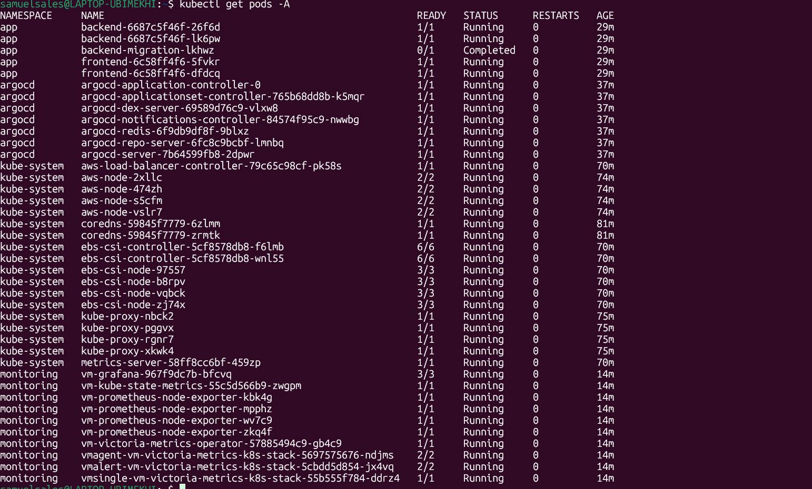
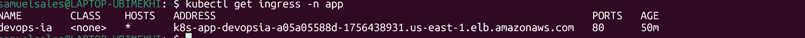
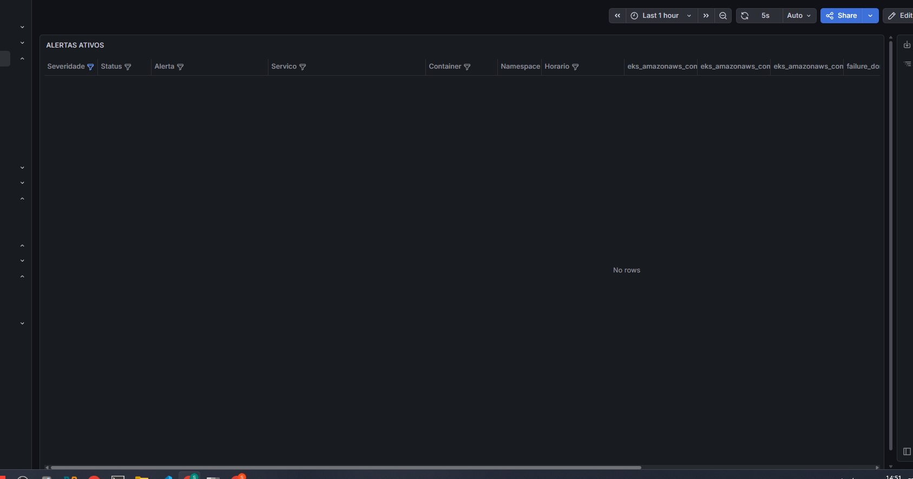
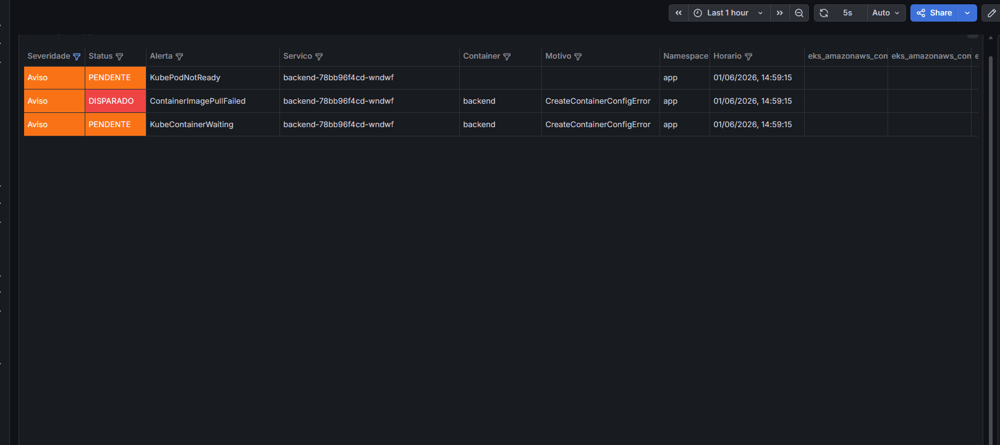
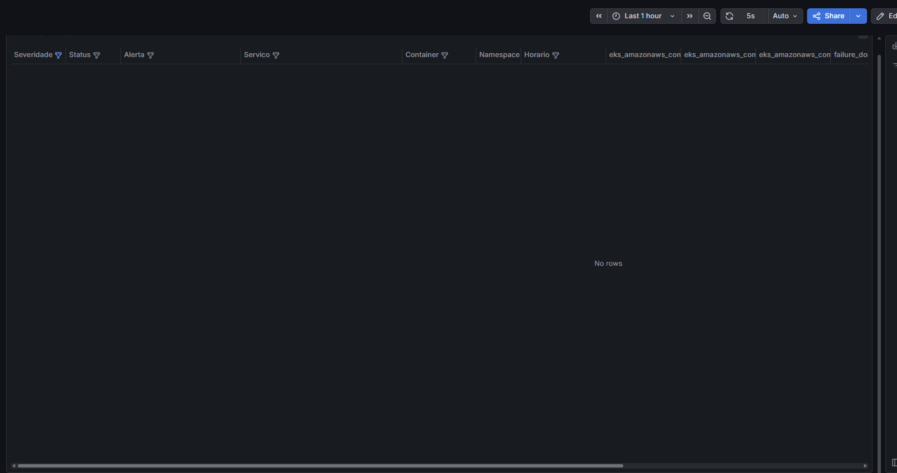

# Cloud Native Platform on AWS

### Terraform, EKS, GitOps, DevSecOps, RDS IAM Auth, Observabilidade e Incident Response

Plataforma cloud native de portfolio completa na AWS, com uma aplicacao real (Incident Tracker) rodando em ambiente production-like. O projeto demonstra praticas que se usam em ambientes reais: infraestrutura como codigo em camadas independentes com Terraform, pipeline CI/CD autenticado via OIDC sem credenciais fixas, entrega continua por GitOps com ArgoCD, banco de dados RDS com autenticacao IAM via IRSA (sem senha estatica), observabilidade com VictoriaMetrics e Grafana, e simulacao de incidentes reais com ciclo SRE completo (deteccao, resposta e documentacao de MTTR).

## Aplicacao

**Incident Tracker** — sistema de gerenciamento de incidentes com autenticacao JWT, criacao e acompanhamento de incidentes, painel de controle e historico.

| Componente | Tecnologia |
|---|---|
| Backend | Node.js 20 + Express + TypeScript + Prisma ORM |
| Frontend | Next.js 14 + Tailwind CSS |
| Banco de dados | RDS PostgreSQL 16, db.t3.micro |
| Autenticacao no banco | IAM Database Auth via IRSA (token SigV4 15 min, sem senha estatica) |
| Namespace Kubernetes | `app` |

### Screenshots da Aplicacao

**Login e Dashboard**


## Arquitetura


## Acesso rapido

| Servico | Endereco |
|---|---|
| Aplicacao (ALB) | `http://k8s-app-devopsia-a05a05588d-1756438931.us-east-1.elb.amazonaws.com` |
| Grafana (port-forward) | `http://localhost:3000` |
| ArgoCD (port-forward) | `https://localhost:8080` |

```bash
# Grafana
kubectl port-forward -n monitoring svc/vm-grafana 3000:80

# ArgoCD
kubectl port-forward -n argocd svc/argocd-server 8080:443

# Credencial do Grafana
kubectl get secret -n monitoring grafana-admin-secret \
  -o jsonpath='{.data.admin-password}' | base64 -d
```

## Infraestrutura em funcionamento

**Nodes EKS e Pods**






**ArgoCD**


**Grafana**


**Pipeline CI/CD e Security Scans**


**CloudWatch Alarms e SNS**


## Platform Alerts Dashboard

Dashboard customizado no Grafana com tabela de alertas ativos em tempo real, com severidade colorida (Info, Aviso, Critico, Desastre) e identificacao precisa do pod e container afetado.

O dashboard e a home do Grafana — ao abrir, o on-call ve imediatamente o estado da plataforma.

Implementado via VMRule (VictoriaMetrics) com alertas customizados para o namespace `app`:

| Alerta | Condicao | Severidade | For |
|---|---|---|---|
| `ContainerImagePullFailed` | Pod nao consegue puxar imagem | Aviso | 30s |
| `PodCrashLooping` | Container reiniciando continuamente | Critico | 1m |
| `DeploymentReplicasMismatch` | Replicas disponiveis menor que desejadas | Aviso | 2m |
| `ContainerOOMKilled` | Container encerrado por falta de memoria | Critico | 0m |

## Incident Response em Producao

Os 4 incidentes abaixo foram simulados em producao real com ciclo SRE completo: deteccao via alerta no Grafana, resposta seguindo runbook, resolucao e documentacao de MTTR.

### INC-004 — Deploy com Imagem Invalida

**Severidade:** Aviso | **MTTR: 6 minutos**

**O que aconteceu:** uma tag de imagem inexistente (`sha-badimage999`) foi commitada no `kustomization.yaml`. O ArgoCD tentou atualizar os deployments, os novos pods entraram em `ImagePullBackOff`, mas os pods antigos continuaram servindo trafego normalmente gracias ao `maxUnavailable: 0`.

**Alertas disparados:**


- `ContainerImagePullFailed` (Aviso/DISPARADO) — pod `backend-5bf79544b9-dd9fv`, container `backend`, motivo `ImagePullBackOff`
- `KubePodNotReady` (Aviso/PENDENTE) — pod nao pronto
- `KubeContainerWaiting` (Aviso/PENDENTE) — container aguardando imagem

**Por que o servico nao caiu:**

A configuracao `maxUnavailable: 0` no RollingUpdate garante que nenhum pod saudavel e terminado antes que um novo esteja pronto. O Kubernetes criou o pod novo (surge), ele falhou ao puxar a imagem, e o pod antigo permaneceu servindo. Zero downtime para usuarios finais.

**Como foi resolvido e por que:**

```bash
# Forma correta (GitOps — mantem repositorio como fonte da verdade)
git revert HEAD
git push origin main
# ArgoCD detecta a mudanca e sincroniza automaticamente

# Forma rapida para emergencia (imperativa — use com cuidado)
kubectl set image deployment/backend \
  backend=<account>.dkr.ecr.us-east-1.amazonaws.com/devops-ia/production/backend:sha-anterior \
  -n app
# ATENCAO: o ArgoCD com selfHeal:true vai reverter se o git nao for atualizado
```

**Diferenca entre tipos de rollback:**

| Cenario | Container sobe? | Rollback correto | MTTR tipico |
|---|---|---|---|
| Imagem invalida (ErrImagePull) | Nao | `git revert` | 5-15 min |
| Imagem com bug (CrashLoop/500s) | Sim | `kubectl rollout undo` + `git revert` | 1-2 min |

O `kubectl rollout undo` usa o ReplicaSet anterior que ainda esta no cluster, sem precisar fazer novo build. Para imagem invalida, o `git revert` e necessario pois nao ha ReplicaSet valido anterior.

**Dashboard apos resolucao:**



---

### INC-003 — Secret Ausente (CreateContainerConfigError)

**Severidade:** Aviso | **MTTR: 5 minutos**

**O que aconteceu:** o Secret `backend-secrets` foi deletado do cluster. O backend nao conseguiu nem iniciar o container porque as variaveis de ambiente `DATABASE_URL` e `JWT_SECRET` nao existiam. O Kubernetes reportou `CreateContainerConfigError` — o pod nem chegou a rodar.

**Alertas disparados:**



- `ContainerImagePullFailed` (Aviso/DISPARADO) — `reason=CreateContainerConfigError`, container `backend`
- `KubePodNotReady` (Aviso/PENDENTE)
- `KubeContainerWaiting` (Aviso/PENDENTE)

**Como foi resolvido e por que:**

O Secret precisa ser recriado com um token IAM fresco (validade 15 min) e um novo JWT secret. Como o banco usa IAM auth sem senha estatica, o token deve ser gerado imediatamente antes de criar o secret.

```bash
# 1. Gerar token IAM (expira em 15 min — executar imediatamente antes do secret)
aws rds generate-db-auth-token \
  --hostname <rds-host> --port 5432 \
  --region us-east-1 --username app_user \
  > /tmp/iam_token.txt

# 2. Construir DATABASE_URL com encoding correto de todos os caracteres especiais
DATABASE_URL=$(python3 - <<'EOF'
import urllib.parse
with open('/tmp/iam_token.txt') as f:
    token = f.read().strip()
encoded = urllib.parse.quote(token, safe='')
print(f"postgresql://app_user:{encoded}@<rds-host>:5432/devops_ia?sslmode=require")
EOF
)
rm -f /tmp/iam_token.txt

# 3. Recriar o secret
kubectl create secret generic backend-secrets \
  --from-literal=database-url="$DATABASE_URL" \
  --from-literal=jwt-secret="$(openssl rand -base64 32)" \
  -n app

# 4. Reiniciar o deployment para pegar o novo secret
kubectl rollout restart deployment/backend -n app
```

**Por que o encoding importa:** o token IAM contem caracteres especiais (`/`, `?`, `=`, `+`) que precisam ser percent-encoded para ser validos em uma URL PostgreSQL. Usar `urllib.parse.quote(token, safe='')` garante que todos os caracteres sao codificados corretamente — inclusive `/` que a funcao ignora por padrao sem `safe=''`.

**Licao aprendida:** secrets criticos devem ter backup do procedimento de recriacao documentado no runbook. Em producao, External Secrets Operator integrado ao AWS Secrets Manager eliminaria a dependencia de secrets manuais.

**Dashboard apos resolucao:**


---

### INC-002 — Container OOMKilled

**Severidade:** Critico | **MTTR: 4 minutos**

**O que aconteceu:** um container com memory limit insuficiente (10Mi) tentou alocar mais memoria do que o limite permitido. O kernel Linux encerrou o processo via OOM Killer com `SIGKILL` (exit code 137). O Kubernetes tentou reiniciar o container, que continuou OOMKilling em loop — caracterizando `CrashLoopBackOff`.

**Alertas disparados:**


- `ContainerOOMKilled` (Critico/DISPARADO) — `pod=oom-demo container=memory-hog reason=OOMKilled`
- `PodCrashLooping` (Critico/DISPARADO) — container reiniciando continuamente

**Como identificar OOMKilled:**

```bash
# Verificar o motivo do encerramento
kubectl describe pod <pod> -n app | grep -A3 "Last State"
# Reason:    OOMKilled
# Exit Code: 137

# Ver consumo atual de memoria
kubectl top pod <pod> -n app

# Diferenca entre exit codes:
# Exit Code 1   = aplicacao crashou (bug, erro de configuracao)
# Exit Code 137 = kernel matou o processo (OOMKilled ou SIGKILL manual)
```

**Como foi resolvido e por que:**

```bash
# Opcao 1 — aumentar o memory limit (causa raiz: limite muito baixo)
kubectl set resources deployment backend \
  --limits=memory=512Mi --requests=memory=128Mi \
  -n app

# Opcao 2 — rollback se o OOM foi introducido por novo codigo com memory leak
kubectl rollout undo deployment/backend -n app
# Depois: git revert para manter o repositorio sincronizado

# Opcao 3 — deletar pod standalone (se nao for Deployment)
kubectl delete pod <pod-oomkilled> -n app
```

**Como estabelecer memory limits corretos:**

Nao chute o valor. Use `kubectl top pod` em staging por pelo menos 24h e observe o P99 de uso de memoria. O limit deve ser no minimo 2x o P99 para absorver picos. Requests devem refletir o uso normal (P50).

**Dashboard apos resolucao:**



---

### INC-001 — RDS Indisponivel (Falha de Autenticacao IAM)

**Severidade:** Critico | **MTTR: 4 minutos**

**O que aconteceu:** o grant `rds_iam` foi revogado do usuario `app_user` no PostgreSQL. Com isso, o RDS passou a rejeitar tokens IAM validos — a autenticacao e dupla: o token IAM precisa ser valido no nivel AWS E o usuario precisa ter `rds_iam` no nivel do banco. Novos pods do backend nao conseguiram conectar, a readinessProbe comecou a falhar, e o ALB parou de rotear trafego para o backend — servico completamente fora do ar com 503.

**Alertas disparados:**


- `PodCrashLooping` (Critico/DISPARADO) — backend reiniciando por falha de conexao ao banco
- `KubePodNotReady` (Aviso/PENDENTE) — pods do backend com readinessProbe falhando
- `DeploymentReplicasMismatch` (Aviso/DISPARADO) — replicas disponiveis abaixo do desejado
- `KubePdbNotEnoughHealthyPods` (Aviso/PENDENTE) — PDB sem pods saudaveis suficientes

**Por que o 503 foi imediato:**

A `readinessProbe` chama `GET /backend/health` a cada 10s. O endpoint `/health` verifica a conexao com o banco. Sem `rds_iam`, a conexao falha, o endpoint retorna 503, a probe falha, e o pod e marcado como `0/1 Ready`. O ALB nao roteia trafego para pods nao prontos — design correto, mas efeito colateral e a indisponibilidade total.

**Como foi resolvido e por que:**

```bash
# 1. Diagnosticar via logs do backend
kubectl logs -l app.kubernetes.io/name=backend -n app | grep -i "error\|auth\|connect\|PAM"
# Procurar: "PAM authentication failed" ou "password authentication failed"

# 2. Verificar se app_user tem rds_iam (via pod temporario — banco e privado)
kubectl run pg-check --image=postgres:16-alpine --restart=Never -n app \
  --env="PGPASSWORD=<master-pass>" \
  -- psql -h <rds-host> -U dbadmin -d devops_ia \
  -c "SELECT pg_has_role('app_user', 'rds_iam', 'member');"
# Resultado esperado: t (true). Se retornar f, o grant foi revogado.

# 3. Restaurar o grant
kubectl run pg-restore --image=postgres:16-alpine --restart=Never -n app \
  --env="PGPASSWORD=<master-pass>" \
  -- psql -h <rds-host> -U dbadmin -d devops_ia \
  -c "GRANT rds_iam TO app_user;"

# 4. Reiniciar deployment para gerar novos tokens IAM
kubectl rollout restart deployment/backend -n app

# 5. Confirmar recuperacao
kubectl get pods -n app
curl http://<alb-endpoint>/backend/health
# Esperado: {"status":"ok","db":"connected"}
```

**Como detectar mais rapido no futuro:**

O CloudWatch alarm `DatabaseConnections` nao captura falhas de autenticacao — o alarme so dispara se houver conexoes ativas. Para detectar falhas de auth, seria necessario um alerta baseado nos logs de erro do RDS via CloudWatch Logs Insights:

```sql
fields @message
| filter @message like /FATAL.*PAM authentication failed/
| stats count() as auth_failures by bin(5m)
| sort auth_failures desc
```

**Dashboard apos resolucao:**


---

### Resumo dos Incidentes

| Incidente | Tipo | Severidade | Impacto | MTTR |
|---|---|---|---|---|
| INC-004 | Imagem invalida (ErrImagePull) | Aviso | Zero downtime — maxUnavailable:0 | 6 min |
| INC-003 | Secret ausente (CreateContainerConfigError) | Aviso | Zero downtime — pods antigos servindo | 5 min |
| INC-002 | OOMKilled — container sem memoria | Critico | Pod em CrashLoop, sem impacto em producao | 4 min |
| INC-001 | RDS indisponivel — rds_iam revogado | Critico | 503 total — readinessProbe bloqueou ALB | 4 min |

## Como Simular os Incidentes

Para reproduzir os incidentes em seu proprio ambiente, aplique as VMRules com thresholds curtos (30s-1m em vez dos 15min padrao) e siga os triggers abaixo.

### Pre-requisito: VMRule de Demo

```bash
# Aplicar regras de alerta com threshold reduzido para demo
kubectl apply -f devops-ia-kubernetes/demo-alerts-vmrule.yaml

# Verificar que foi carregada pelo VMAlert
kubectl get vmrule devops-ia-demo-alerts -n monitoring
```

### Simular INC-004 — Imagem Invalida

```bash
# 1. Trigger: injetar tag inexistente diretamente no deployment
kubectl set image deployment/backend \
  backend=<account>.dkr.ecr.us-east-1.amazonaws.com/devops-ia/production/backend:sha-badimage999 \
  -n app
kubectl set image deployment/frontend \
  frontend=<account>.dkr.ecr.us-east-1.amazonaws.com/devops-ia/production/frontend:sha-badimage999 \
  -n app

# 2. Observar: pods novos em ErrImagePull, pods antigos continuam Running
kubectl get pods -n app -w

# 3. Aguardar ~1 min: alertas ContainerImagePullFailed e KubePodNotReady no Grafana

# 4. Resolucao correta (GitOps):
git revert HEAD && git push origin main
# ArgoCD sincroniza automaticamente

# 4. Resolucao rapida (imperativa):
kubectl set image deployment/backend backend=<account>.dkr.ecr.us-east-1.amazonaws.com/devops-ia/production/backend:sha-da9bf41 -n app
kubectl set image deployment/frontend frontend=<account>.dkr.ecr.us-east-1.amazonaws.com/devops-ia/production/frontend:sha-da9bf41 -n app
```

### Simular INC-003 — Secret Ausente

```bash
# 1. Trigger: deletar o secret e forcar restart
kubectl delete secret backend-secrets -n app
kubectl rollout restart deployment/backend -n app

# 2. Observar: CreateContainerConfigError nos novos pods
kubectl get pods -n app -w
kubectl describe pod -l app.kubernetes.io/name=backend -n app | grep -A3 "Events"

# 3. Aguardar ~30s: alerta ContainerImagePullFailed (reason=CreateContainerConfigError) no Grafana

# 4. Resolucao: recriar o secret (ver secao Secrets Manuais)
aws rds generate-db-auth-token --hostname <rds-host> --port 5432 \
  --region us-east-1 --username app_user > /tmp/token.txt
DATABASE_URL=$(python3 -c "
import urllib.parse
with open('/tmp/iam_token.txt') as f:
    token = f.read().strip()
encoded = urllib.parse.quote(token, safe='')
print(f'postgresql://app_user:{encoded}@<rds-host>:5432/devops_ia?sslmode=require')
")
kubectl create secret generic backend-secrets \
  --from-literal=database-url="$DATABASE_URL" \
  --from-literal=jwt-secret="$(openssl rand -base64 32)" -n app
kubectl rollout restart deployment/backend -n app
```

### Simular INC-002 — OOMKilled

```bash
# 1. Trigger: criar pod com memory limit de 10Mi e script que aloca memoria agressivamente
cat <<'EOF' | kubectl apply -f -
apiVersion: v1
kind: Pod
metadata:
  name: oom-demo
  namespace: app
  labels:
    app: oom-demo
spec:
  restartPolicy: Always
  containers:
  - name: memory-hog
    image: node:20-alpine
    command: ["node", "-e", "const x=[];while(true){x.push(Buffer.alloc(1024*1024*10))}"]
    resources:
      requests:
        memory: "5Mi"
        cpu: "10m"
      limits:
        memory: "10Mi"
        cpu: "200m"
EOF

# 2. Observar: OOMKilled e CrashLoopBackOff
kubectl get pod oom-demo -n app -w
kubectl describe pod oom-demo -n app | grep -A3 "Last State"
# Esperado: Reason: OOMKilled, Exit Code: 137

# 3. Aguardar ~30s: alertas ContainerOOMKilled (Critico) e PodCrashLooping (Critico) no Grafana

# 4. Resolucao: deletar o pod de demo
kubectl delete pod oom-demo -n app

# Em producao (Deployment com OOM):
kubectl set resources deployment backend --limits=memory=512Mi --requests=memory=128Mi -n app
# ou
kubectl rollout undo deployment/backend -n app
```

### Simular INC-001 — RDS Indisponivel

```bash
# Pre-requisito: obter senha master do RDS
MASTER_SECRET_ARN=$(cd devops-ia-terraform/05-database-stack-ai && terraform output -raw db_master_user_secret_arn)
MASTER_PASS=$(aws secretsmanager get-secret-value --secret-id "$MASTER_SECRET_ARN" \
  --query 'SecretString' --output text | python3 -c "import sys,json; d=json.load(sys.stdin); print(d['password'])")

# 1. Trigger: revogar rds_iam do app_user via pod temporario
kubectl run pg-revoke --image=postgres:16-alpine --restart=Never -n app \
  --env="PGPASSWORD=$MASTER_PASS" \
  -- psql -h <rds-host> -U dbadmin -d devops_ia \
  -c "REVOKE rds_iam FROM app_user;"

# Forcar todos os pods a reconectarem
kubectl delete pods -n app -l app.kubernetes.io/name=backend

# 2. Observar: 503 no ALB, pods em 0/1 Ready
curl http://<alb-endpoint>/backend/health
# Esperado: 503 Service Unavailable

kubectl get pods -n app
# backend-xxx   0/1   Running   1   30s  <- readinessProbe falhando

# 3. Aguardar ~30s-1min: alertas PodCrashLooping (Critico) e DeploymentReplicasMismatch no Grafana

# 4. Resolucao: restaurar o grant e reiniciar
kubectl run pg-restore --image=postgres:16-alpine --restart=Never -n app \
  --env="PGPASSWORD=$MASTER_PASS" \
  -- psql -h <rds-host> -U dbadmin -d devops_ia \
  -c "GRANT rds_iam TO app_user;"

kubectl rollout restart deployment/backend -n app

# Confirmar recuperacao
curl http://<alb-endpoint>/backend/health
# Esperado: {"status":"ok","db":"connected"}
```

## Estrutura do repositorio

```
devops-ia-terraform/
  00-remote-backend-stack-ai/    S3 state + DynamoDB lock
  01-networking-stack-ai/        VPC, subnets, NAT Gateway, Flow Logs
  02-eks-stack-ai/               Cluster EKS 1.31, Node Group t3.small, ECR, acesso
  03-ci-cd-stack-ai/             OIDC Provider GitHub + IAM Role para o CI
  04-addons-stack-ai/            metrics-server, AWS LBC, EBS CSI Driver (IRSA)
  05-database-stack-ai/          RDS PostgreSQL 16, IRSA backend, SG, CloudWatch alarms

devops-ia-kubernetes/
  backend/                       ServiceAccount, ConfigMap, Deployment, Service, PDB, Migration Job
  frontend/                      Deployment, Service, PDB
  storage/                       StorageClass gp3 (default do cluster)
  demo-alerts-vmrule.yaml        VMRules customizadas para o namespace app (threshold 30s-1m)
  ingress.yaml                   ALB Ingress: / frontend, /backend/* backend
  kustomization.yaml             GitOps root: recursos + image tags
  argocd-application.yaml        ArgoCD Application (aplicado uma vez no bootstrap)
  monitoring-application.yaml    ArgoCD Application de monitoramento

devops-ia-apps/
  backend/                       Node.js + Express + TypeScript + Prisma
    src/lib/prisma.ts              Cliente Prisma com IAM token refresh proativo (13min)
    prisma/migrations/             Migrations versionadas (baseline 0_init)
    prisma/schema.prisma           Schema Prisma
  frontend/
    devops-ia-platform/            Next.js 14 + Tailwind CSS

.github/workflows/
  ci-cd.yml                      Build, push ECR, atualiza kustomization
  security-scans.yml             Gitleaks, Checkov, Semgrep, npm audit, Trivy (em cada push)
  security-scheduled.yml         Varredura diaria 06:00 UTC

docs/
  ADR-XXXX-*.md                  Architecture Decision Records
  implementation/                Registros de implementacao
  runbooks/                      Runbooks operacionais (5 arquivos)
  incidents/                     Incidentes simulados com MTTR real (INC-001 a INC-004)
  architecture/screenshots/      Screenshots da plataforma e incidentes
```

## Stacks Terraform

Cada stack e um diretorio independente com seu proprio state remoto no S3. Aplicadas em sequencia porque dependem umas das outras via `terraform_remote_state`. Nenhuma stack usa modulos comunitarios — apenas recursos nativos do provider `hashicorp/aws`.

### Stack 00: Remote Backend

Cria o bucket S3 (`devops-ia-production-terraform-state-<account-id>`) e a tabela DynamoDB para lock de state. Aplicada uma vez, nunca destruida.

### Stack 01: Networking

VPC multi-AZ (CIDR `/16`) com 3 subnets publicas e 3 subnets privadas em `us-east-1a/b/c`, NAT Gateway, Internet Gateway, route tables separadas por tier e VPC Flow Logs habilitados. Subnets publicas recebem a tag `kubernetes.io/role/elb = "1"` para auto-descoberta pelo AWS LBC.

### Stack 02: EKS

Cluster `devops-ia-production` (Kubernetes 1.31) com Managed Node Group de 4 instancias `t3.small` (AMI `AL2023_x86_64_STANDARD`), distribuidos em 3 AZs. Inclui OIDC Provider (base para IRSA), repositorios ECR e access entries.

> Ajuste a quantidade e o tipo dos nodes conforme o orcamento. 4x `t3.small` garante capacidade para app + ArgoCD + monitoring. Para reducao de custo, 2x `t3.medium` pode ser suficiente.

### Stack 03: CI/CD (OIDC)

Registra o GitHub como OIDC Identity Provider e cria a IAM Role `devops-ia-production-github-actions`. A trust policy restringe a assuncao da role a tokens gerados por este repositorio — sem credenciais estaticas.

### Stack 04: Addons

- **metrics-server**: metricas de CPU/memoria para `kubectl top` e HPA
- **AWS Load Balancer Controller**: cria e gerencia ALBs via recursos `Ingress`, com IRSA propria
- **EBS CSI Driver** (addon gerenciado): provisionamento dinamico de PersistentVolumes EBS com IRSA
- **StorageClass `gp3`**: default do cluster, encrypted

### Stack 05: Database

RDS PostgreSQL 16 (`db.t3.micro`, single-AZ, 20 GB gp3) com subnet group em subnets privadas, SG permitindo porta 5432 apenas dos nodes EKS, `rds.force_ssl = 1`, IAM Authentication habilitada, IRSA para o backend e CloudWatch alarms com SNS.

## Autenticacao IAM no banco (IRSA)

O backend nao usa senha de banco. O fluxo:

1. O pod tem o ServiceAccount `backend` anotado com o ARN da IRSA role
2. O EKS injeta um token OIDC no pod via `automountServiceAccountToken: true`
3. `src/lib/prisma.ts` usa `@aws-sdk/rds-signer` para gerar um token IAM (SigV4) valido por 15 minutos
4. O Prisma conecta com `postgresql://app_user:<token>@<host>:5432/devops_ia?sslmode=require`
5. Um timer faz refresh proativo a cada 13 minutos (2 minutos antes do vencimento)

O usuario `app_user` precisa ter `GRANT rds_iam` no PostgreSQL — sem isso, o token IAM e rejeitado mesmo sendo valido no nivel AWS (autorizacao dupla).

> Se o backend retornar `PAM authentication failed` ou `password authentication failed` nos logs, verifique primeiro se `app_user` tem o grant: `SELECT pg_has_role('app_user', 'rds_iam', 'member');`

## Pipeline CI/CD

**Trigger**: push em `clean-main` com mudancas em `devops-ia-apps/**`

| Job | O que faz |
|---|---|
| `detect-changes` | Detecta quais apps mudaram via `dorny/paths-filter` |
| `build-backend` | Autentica via OIDC, `docker build`, push para ECR com tag `sha-<7 chars>` |
| `build-frontend` | Mesma sequencia para o Next.js 14 |
| `update-kustomization` | Atualiza tags no `kustomization.yaml`, commita com `[skip ci]` |

O ArgoCD detecta o novo commit e sincroniza o cluster automaticamente. O Migration Job (PreSync hook) roda `prisma migrate deploy` antes de qualquer deploy — se a migration falhar, o sync e abortado.

## Pipeline de Seguranca

**Trigger**: push em `clean-main` e PRs

| Job | Ferramenta | Criterio de bloqueio |
|---|---|---|
| `secret-scan` | Gitleaks | Qualquer achado bloqueia |
| `iac-tf-scan` | Checkov | CRITICAL bloqueia |
| `iac-k8s-scan` | Checkov | CRITICAL bloqueia |
| `sast-frontend` | Semgrep | Findings viram anotacoes no PR |
| `sast-backend` | Semgrep | Findings viram anotacoes no PR |
| `sca-frontend` | npm audit + Trivy fs | CRITICAL bloqueia, HIGH: SLA 7 dias |
| `sca-backend` | npm audit + Trivy fs | CRITICAL bloqueia, HIGH: SLA 7 dias |
| `container-frontend` | Trivy image | CRITICAL bloqueia |
| `container-backend` | Trivy image | CRITICAL bloqueia |

Varredura diaria as 06:00 UTC detecta CVEs publicados apos o ultimo push.

## Kubernetes e GitOps

O ArgoCD monitora `clean-main`, path `devops-ia-kubernetes/`, com `automated: {prune: true, selfHeal: true}`. Qualquer commit vira realidade no cluster em ate 3 minutos.

Requisitos por Deployment:
- 2 replicas minimo
- `RollingUpdate` com `maxUnavailable: 0` (zero downtime)
- `readinessProbe` + `livenessProbe`
- `requests` + `limits` de CPU e memoria
- `podAntiAffinity` preferencial por hostname (replicas em nodes diferentes)
- `revisionHistoryLimit: 3`
- `runAsNonRoot: true`, `allowPrivilegeEscalation: false`, `readOnlyRootFilesystem: true`

## Observabilidade

Stack VictoriaMetrics k8s stack (Helm), namespace `monitoring`, gerenciada pelo ArgoCD.

| Componente | Funcao |
|---|---|
| `vmsingle` | Armazena metricas (PVC gp3 5 Gi, encrypted, retencao 7d) |
| `vmagent` | Scraping de metricas de pods, nodes e objetos Kubernetes |
| `vmalert` | Avaliacao de regras de alerta (VMRules) |
| `grafana` | Dashboards, datasource Prometheus apontando para vmsingle |
| `kube-state-metrics` | Metricas de estado dos objetos Kubernetes |
| `node-exporter` | DaemonSet: metricas de hardware e SO dos nodes |

CloudWatch alarms para RDS: `DatabaseConnections > 80`, `FreeStorageSpace < 5 GB`, `FreeableMemory < 64 MB` — todos com notificacao via SNS para email.

## Seguranca

| Componente | Metodo |
|---|---|
| Backend -> RDS | IAM Database Auth via IRSA (token SigV4 15 min, sem senha estatica) |
| GitHub Actions -> AWS | OIDC federation (sem credenciais estaticas no repositorio) |
| EBS CSI Driver -> AWS | IRSA dedicada |
| Pods | `runAsNonRoot`, `readOnlyRootFilesystem`, drop ALL capabilities |
| Volumes EBS | gp3 encrypted |
| TLS no banco | `rds.force_ssl = 1` + `sslmode=require` na connection string |
| Secrets fora do Git | `backend-secrets`, `grafana-admin-secret` — criados manualmente, nunca commitados |

## Do zero ao ar

### Pre-requisitos

- AWS CLI configurada com permissoes para VPC, EKS, IAM, S3, ECR, RDS
- Terraform `>= 1.10`
- kubectl instalado
- Docker instalado (para build das imagens)

### 1. Backend remoto

```bash
cd devops-ia-terraform/00-remote-backend-stack-ai
terraform init && terraform apply -var-file="envs/production.tfvars"
```

### 2. Rede, EKS, OIDC e Addons

```bash
for stack in 01-networking-stack-ai 02-eks-stack-ai 03-ci-cd-stack-ai 04-addons-stack-ai; do
  cd devops-ia-terraform/$stack
  terraform init
  terraform apply -auto-approve -var-file="envs/production.tfvars"
  cd ../..
done

aws eks update-kubeconfig --name devops-ia-production --region us-east-1
kubectl get nodes  # confirmar 4 nodes Ready
```

### 3. Banco de dados RDS

```bash
cd devops-ia-terraform/05-database-stack-ai
terraform init && terraform apply -var-file="envs/production.tfvars"

# Obter senha master
MASTER_SECRET_ARN=$(terraform output -raw db_master_user_secret_arn)
MASTER_PASS=$(aws secretsmanager get-secret-value --secret-id "$MASTER_SECRET_ARN" \
  --query 'SecretString' --output text | python3 -c "import sys,json; d=json.load(sys.stdin); print(d['password'])")

# Criar app_user com IAM auth (dentro do cluster — banco e privado)
kubectl create namespace app
kubectl run pg-setup --image=postgres:16-alpine --restart=Never -n app \
  --env="PGPASSWORD=$MASTER_PASS" \
  -- psql -h <rds-host> -U dbadmin -d devops_ia \
  -c "CREATE USER app_user; GRANT rds_iam TO app_user; GRANT ALL ON DATABASE devops_ia TO app_user; GRANT ALL ON SCHEMA public TO app_user; ALTER DEFAULT PRIVILEGES IN SCHEMA public GRANT ALL ON TABLES TO app_user; ALTER DEFAULT PRIVILEGES IN SCHEMA public GRANT ALL ON SEQUENCES TO app_user;"
```

### 4. Build e Push das imagens

```bash
SHA="sha-$(git rev-parse --short HEAD)"
ACCOUNT="<account-id>"
REGION="us-east-1"

aws ecr get-login-password --region $REGION | \
  docker login --username AWS --password-stdin $ACCOUNT.dkr.ecr.$REGION.amazonaws.com

# Backend
cd devops-ia-apps/backend
docker build --platform=linux/amd64 \
  -t $ACCOUNT.dkr.ecr.$REGION.amazonaws.com/devops-ia/production/backend:$SHA \
  -t $ACCOUNT.dkr.ecr.$REGION.amazonaws.com/devops-ia/production/backend:latest .
docker push $ACCOUNT.dkr.ecr.$REGION.amazonaws.com/devops-ia/production/backend:$SHA
docker push $ACCOUNT.dkr.ecr.$REGION.amazonaws.com/devops-ia/production/backend:latest

# Frontend
cd ../frontend/devops-ia-platform
docker build --platform=linux/amd64 \
  -t $ACCOUNT.dkr.ecr.$REGION.amazonaws.com/devops-ia/production/frontend:$SHA \
  -t $ACCOUNT.dkr.ecr.$REGION.amazonaws.com/devops-ia/production/frontend:latest .
docker push $ACCOUNT.dkr.ecr.$REGION.amazonaws.com/devops-ia/production/frontend:$SHA
docker push $ACCOUNT.dkr.ecr.$REGION.amazonaws.com/devops-ia/production/frontend:latest

# Atualizar kustomization.yaml com a nova tag e commitar
sed -i "s/newTag: .*/newTag: $SHA/" devops-ia-kubernetes/kustomization.yaml
git add devops-ia-kubernetes/kustomization.yaml
git commit -m "chore: update image tag to $SHA"
git push origin clean-main
```

### 5. Secrets e Deploy

```bash
# Gerar token IAM e criar backend-secrets
aws rds generate-db-auth-token \
  --hostname <rds-host> --port 5432 --region us-east-1 --username app_user \
  > /tmp/iam_token.txt

DATABASE_URL=$(python3 - <<'EOF'
import urllib.parse
with open('/tmp/iam_token.txt') as f:
    token = f.read().strip()
encoded = urllib.parse.quote(token, safe='')
print(f"postgresql://app_user:{encoded}@<rds-host>:5432/devops_ia?sslmode=require")
EOF
)
rm -f /tmp/iam_token.txt

kubectl create secret generic backend-secrets \
  --from-literal=database-url="$DATABASE_URL" \
  --from-literal=jwt-secret="$(openssl rand -base64 32)" \
  -n app

# Aplicar manifestos via kustomize
kubectl apply -k devops-ia-kubernetes/

# Aguardar migration job completar
kubectl wait --for=condition=complete job/backend-migration -n app --timeout=120s
kubectl get pods -n app
```

### 6. ArgoCD e Monitoring

```bash
# ArgoCD
kubectl create namespace argocd
kubectl apply -n argocd \
  -f https://raw.githubusercontent.com/argoproj/argo-cd/stable/manifests/install.yaml \
  --server-side --force-conflicts

kubectl wait --for=condition=available deployment/argocd-server -n argocd --timeout=180s

# Monitoring
kubectl create namespace monitoring
kubectl create secret generic grafana-admin-secret \
  --from-literal=admin-user=admin \
  --from-literal=admin-password="$(openssl rand -base64 16)" \
  -n monitoring

# Aplicar Applications
kubectl apply -f devops-ia-kubernetes/argocd-application.yaml
kubectl apply -f devops-ia-kubernetes/monitoring-application.yaml
```

### 7. Usuario demo

```bash
ALB=$(kubectl get ingress devops-ia -n app -o jsonpath='{.status.loadBalancer.ingress[0].hostname}')

curl -X POST "http://$ALB/backend/auth/register" \
  -H "Content-Type: application/json" \
  -d '{"email":"demo@example.com","password":"Demo@2026","name":"Demo User"}'
```

## Dados do ambiente

| Item | Valor |
|---|---|
| Regiao | `us-east-1` |
| Cluster EKS | `devops-ia-production` |
| Banco | `devops_ia` |
| Usuario DB | `app_user` (IAM auth via `rds_iam` grant) |
| ALB endpoint | Obtido via `kubectl get ingress devops-ia -n app` |
| RDS endpoint | Obtido via `terraform output db_instance_endpoint` (stack 05) |
| ECR backend | `<account>.dkr.ecr.us-east-1.amazonaws.com/devops-ia/production/backend` |
| ECR frontend | `<account>.dkr.ecr.us-east-1.amazonaws.com/devops-ia/production/frontend` |
| GitHub Actions role | Output `terraform output` (stack 03) |
| Backend IRSA role | Output `terraform output backend_irsa_role_arn` (stack 05) |

## ADRs (Architecture Decision Records)

| ADR | Titulo | Status |
|---|---|---|
| ADR-0001 | VPC multi-AZ com subnets publicas e privadas | Accepted |
| ADR-0002 | Backend remoto S3 para o state do Terraform | Accepted |
| ADR-0003 | Cluster EKS e configuracao do node group | Accepted |
| ADR-0004 | OIDC Provider e IAM Role para GitHub Actions | Accepted |
| ADR-0005 | Pipeline CI/CD com GitHub Actions | Accepted |
| ADR-0006 | ArgoCD e padrao GitOps | Accepted |
| ADR-0007 | Observabilidade com VictoriaMetrics (free-tier) | Accepted |
| ADR-0009 | Seguranca no pipeline com scans automatizados | Accepted |
| ADR-0010 | Estrategia de rollback e recovery | Accepted |
| ADR-0013 | RDS PostgreSQL free-tier | Accepted |
| ADR-0014 | Conectividade EKS-RDS via IRSA (IAM Database Auth) | Accepted |
| ADR-0015 | Autenticacao JWT | Accepted |
| ADR-0016 | Database migrations com Prisma migrate deploy | Accepted |
| ADR-0017 | Observabilidade de app e RDS (CloudWatch alarms) | Accepted |

## Runbooks

Documentacao operacional em `docs/runbooks/`:

| Runbook | Cobre |
|---|---|
| `db-connection-failed.md` | Falhas de conexao RDS: rds_iam, IRSA, token expirado |
| `oomkilled.md` | OOMKilled: diagnostico, ajuste de limits, rollback |
| `rollback-application.md` | Rollback de deployment: git revert vs rollout undo |
| `high-latency.md` | Latencia alta: profiling, conexoes de banco, throttling |
| `rollback-infrastructure.md` | Rollback de Terraform, state recovery |

## Roadmap

- **Loki + Grafana Alloy**: agregacao de logs dos pods no Grafana com correlacao com metricas
- **Tempo**: distributed tracing com OpenTelemetry SDK no backend
- **Alertmanager**: routing de alertas Kubernetes para email/Slack/PagerDuty
- **External Secrets Operator**: integracao com AWS Secrets Manager para eliminar secrets manuais
