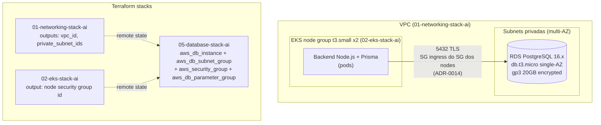

# ADR-0013: RDS PostgreSQL como banco relacional do Incident Tracker

## Status
Proposed

## Data
2026-05-30

## Contexto

A aplicacao `devops-ia` Incident Tracker (backend Node.js + Express + TypeScript + Prisma) precisa de um banco relacional persistente para armazenar usuarios e incidentes. O schema Prisma (`prisma/schema.prisma`) define:

- `User` (autenticacao via JWT, senha com hash bcrypt)
- `Incident` (com enums `Severity` SEV1-SEV4 e `IncidentStatus` OPEN/INVESTIGATING/RESOLVED)

Antes desta evolucao o backend era um placeholder .NET sem banco. A migracao para Node.js + Prisma exige um Postgres real para que `prisma migrate deploy` (ADR-0016) e as queries da aplicacao funcionem.

### Constraints levantados no discovery

- **Conta AWS**: `074994084847`, regiao `us-east-1`. Credito promocional de **US$ 100** (nao e o free tier legado de 12 meses, entao a estrategia e maximizar a cobertura do credito, nao depender de elegibilidade free tier de instancia).
- **Infra existente reaproveitavel**: VPC multi-AZ com subnets privadas (`01-networking-stack-ai`), cluster EKS com managed node group `t3.small x2` (`02-eks-stack-ai`), OIDC provider habilitado (stack 04) para IRSA.
- **Engine fixado pela aplicacao**: PostgreSQL (Prisma com `provider = "postgresql"`).
- **Provider Terraform**: `hashicorp/aws ~> 6.0` (validado via terraform-mcp: versao mais recente 6.47.0, compativel). Apenas recursos nativos, sem modulos comunitarios.
- **Carga prevista**: workshop/MVP, baixo volume (poucas conexoes simultaneas, < 10 pods clientes).

### Validacoes via MCP

- **aws-mcp** ([Amazon RDS DB instance storage](https://docs.aws.amazon.com/AmazonRDS/latest/UserGuide/CHAP_Storage.html)): A AWS confirma que os tipos de storage RDS sao `io1/io2` (I/O intensivo), `gp2/gp3` (SSD de proposito geral) e magnetic (legado, nao recomendado). **A AWS esta descontinuando o storage magnetic em 30 de abril de 2026 e recomenda migrar para `gp3` ou `io2` antes dessa data.** O `gp2` tambem esta em trajetoria de descontinuacao para novos workloads em favor do `gp3`. **Decisao: usar `gp3`, nunca `gp2` nem magnetic.**
- **terraform-mcp** (`aws_db_instance`, provider 6.47.0): recurso nativo suporta `storage_type = "gp3"`, `storage_encrypted = true`, `kms_key_id`, `backup_retention_period` (0-35), `iam_database_authentication_enabled`, `parameter_group_name`, `vpc_security_group_ids`, `db_subnet_group_name`, `multi_az`. Todos os argumentos necessarios estao disponiveis sem modulo de terceiros.
- **aws-mcp** ([Extended Support](https://docs.aws.amazon.com/AmazonRDS/latest/UserGuide/extended-support-overview.html)): versoes major fora do suporte padrao entram em Extended Support (cobrado). PostgreSQL 16.x esta dentro do suporte padrao, evitando esse custo.

## Drivers da Decisao

- Persistencia confiavel para User/Incident com o menor custo possivel dentro de US$ 100 de credito.
- Reaproveitar a VPC e subnets privadas existentes (sem expor o banco a internet).
- Banco gerenciado (sem operar Postgres em pod, que disputaria a RAM escassa dos `t3.small`).
- Storage moderno e nao depreciado (`gp3`), criptografado em repouso.
- Isolar o banco em sua propria stack Terraform para ciclo de vida independente das stacks de rede e compute.

## Opcoes Consideradas

### Opcao A: RDS PostgreSQL `db.t3.micro` single-AZ, `gp3` 20GB (Recomendada)

- **Descricao**: Uma instancia RDS PostgreSQL 16.x, classe `db.t3.micro` (2 vCPU burstable, 1 GiB RAM), single-AZ, storage `gp3` 20 GiB criptografado com a chave KMS default do RDS (`aws/rds`), em subnets privadas da VPC existente. Stack Terraform dedicada `05-database-stack-ai`.
- **Pros**:
  - Menor custo de instancia RDS gerenciada disponivel para Postgres.
  - `gp3` com baseline 3000 IOPS / 125 MiB/s incluso, sem custo adicional de IOPS no piso de 20 GiB.
  - Criptografia em repouso com KMS default (sem custo de CMK dedicada).
  - Single-AZ elimina o custo dobrado de standby do Multi-AZ.
  - Banco gerenciado: backups automaticos, patching, sem footprint no cluster EKS.
- **Contras**:
  - Single-AZ nao oferece failover automatico (RPO/RTO dependem de restore de backup).
  - `db.t3.micro` (1 GiB RAM) suporta numero limitado de conexoes (~80-90). Mitigado pelo baixo volume MVP e por connection pooling no Prisma.
  - Sem free tier de instancia (conta com credito, nao elegivel legado), entao consome credito desde o dia 1.
- **Custo estimado**: ~US$ 13/mes (instancia `db.t3.micro` on-demand ~US$ 12-13 + `gp3` 20 GiB ~US$ 1.84 + backups dentro do tamanho do banco, sem custo extra relevante). Com US$ 100 de credito: **~7 meses de cobertura**.

### Opcao B: RDS PostgreSQL `db.t3.micro` Multi-AZ, `gp3` 20GB

- **Descricao**: Mesma configuracao da Opcao A, porem com `multi_az = true` (standby sincrono em outra AZ).
- **Pros**:
  - Failover automatico em falha de AZ/instancia (RTO ~1-2 min, RPO ~0).
  - Patching com menos downtime (failover para standby).
- **Contras**:
  - **Custo aproximadamente dobrado** (~US$ 26/mes), reduzindo a cobertura do credito para ~3.8 meses.
  - HA nao e requisito do MVP/workshop; o custo nao se justifica nesta fase.
- **Custo estimado**: ~US$ 26/mes. Com US$ 100 de credito: **~3.8 meses de cobertura**.

### Opcao C: PostgreSQL self-hosted em pod no EKS (StatefulSet + PVC EBS)

- **Descricao**: Rodar Postgres como StatefulSet no cluster, com PVC `gp3` via EBS CSI driver.
- **Pros**:
  - Sem custo de instancia RDS (apenas o EBS do PVC, ~US$ 1.84/mes para 20 GiB).
  - Aprendizado de operacao de stateful workloads no Kubernetes.
- **Contras**:
  - Disputa a RAM escassa dos `t3.small` (Postgres confortavel pede ~256-512 MiB+), competindo com backend, ArgoCD e metrics-server (ver ADR-0007), risco de OOMKill.
  - Operacao manual de backup, restore, patching, alta disponibilidade.
  - Sem IAM DB auth nativo (perde a integracao IRSA planejada na ADR-0014).
  - Durabilidade dependente de um unico PVC/AZ; perda do node ou da AZ pode comprometer o dado sem replicacao.
- **Custo estimado**: ~US$ 2/mes (EBS), mas com alto custo operacional e de risco, descartada.

## Decisao

**Opcao A: RDS PostgreSQL `db.t3.micro` single-AZ, `gp3` 20 GiB, PostgreSQL 16.x, em subnets privadas, criptografado, em uma nova stack `05-database-stack-ai`.**

Justificativa contra os 6 pilares do AWS Well-Architected:

1. **Operational Excellence**: Banco gerenciado pela AWS (patching, backup automatico, snapshots). Stack Terraform isolada permite evoluir o banco sem tocar nas stacks de rede e compute. `prisma migrate deploy` (ADR-0016) padroniza a evolucao de schema.
2. **Security**: Instancia em subnets privadas, sem `publicly_accessible`. `storage_encrypted = true` com KMS default. Parametro `rds.force_ssl = 1` obriga TLS em transito. Acesso restrito por security group (ADR-0014). IAM DB auth (ADR-0014) elimina senha estatica.
3. **Reliability**: Backups automaticos com retencao de 7 dias e janela definida permitem point-in-time recovery. Single-AZ e trade-off consciente do MVP, o RPO/RTO aceito e o do restore de backup (na ordem de minutos a dezenas de minutos). Caminho de evolucao para Multi-AZ documentado (Opcao B).
4. **Performance Efficiency**: `gp3` entrega 3000 IOPS / 125 MiB/s de baseline sem custo extra, superior ao `gp2` na mesma faixa. `db.t3.micro` burstable e adequado ao volume MVP. Connection pooling no Prisma respeita o limite de conexoes da classe.
5. **Cost Optimization**: Menor classe Postgres gerenciada, single-AZ, storage no piso de 20 GiB. ~US$ 13/mes maximiza a cobertura do credito de US$ 100 (~7 meses). KMS default evita custo de CMK. Sem Extended Support (PostgreSQL 16.x esta em suporte padrao).
6. **Sustainability**: Instancia minima dimensionada ao uso real; sem standby ocioso (single-AZ); storage no piso; banco gerenciado evita over-provisioning de node para rodar Postgres.

## Consequencias

- **Positivas**:
  - Persistencia gerenciada e duravel para a aplicacao real, com backup e PITR.
  - Sem footprint de RAM no cluster `t3.small` (libera margem para backend, ArgoCD, metrics-server).
  - Storage moderno (`gp3`), criptografado, TLS obrigatorio, postura de seguranca solida desde o inicio.
  - Habilita IAM DB auth via IRSA (ADR-0014), eliminando senha estatica.
  - Ciclo de vida isolado na stack `05-database-stack-ai`.

- **Negativas / Trade-offs aceitos**:
  - Single-AZ: sem failover automatico. Falha de AZ exige restore (downtime na ordem de minutos). Aceito no MVP.
  - `db.t3.micro` limita conexoes (~80-90); exige pooling no Prisma e monitoramento (ADR-0017).
  - Consome credito desde o dia 1 (~US$ 13/mes); a cobertura de ~7 meses define o horizonte do workshop antes de revisitar custo.

- **Riscos e mitigacoes**:
  - *Risco*: Esgotamento de conexoes em `db.t3.micro`. *Mitigacao*: connection pool do Prisma com limite conservador; alarme CloudWatch `DatabaseConnections > 80` (ADR-0017).
  - *Risco*: Disco cheio (20 GiB). *Mitigacao*: alarme `FreeStorageSpace < 5GB` (ADR-0017); `max_allocated_storage` para storage autoscaling como opcao futura.
  - *Risco*: Perda de dado por falha de AZ (single-AZ). *Mitigacao*: backup retention 7 dias + PITR; promover para Multi-AZ (Opcao B) se o workload deixar de ser MVP.
  - *Risco*: Credito esgota em ~7 meses. *Mitigacao*: alarme de billing; reavaliar classe/Reserved Instance antes do fim do credito.

## Diagrama



## Implementation Guidelines (para o DevOps Engineer Agent)

- **IaC stack**: Terraform, provider `hashicorp/aws ~> 6.0` (validado: 6.47.0). Nova stack `05-database-stack-ai`. **Nao** adicionar ao stack 02.
- **Estrutura de arquivos** (conforme `.claude/rules/terraform-naming-conventions.md`):
  ```
  05-database-stack-ai/
  ├── versions.tf
  ├── main.tf                  # provider + data sources de remote state
  ├── variables.tf             # variavel agrupada "database" (object)
  ├── outputs.tf               # db_instance_endpoint, db_instance_address, db_instance_resource_id
  ├── tags.tf
  ├── rds.tf                   # aws_db_instance
  ├── rds.subnet-group.tf      # aws_db_subnet_group (private subnets)
  ├── rds.security-group.tf    # aws_security_group (ingress 5432 do SG dos nodes, ver ADR-0014)
  ├── rds.parameter-group.tf   # aws_db_parameter_group (force_ssl = 1)
  └── envs/
      └── production.tfvars
  ```
- **Recursos necessarios** (nativos, validados via terraform-mcp):
  - `aws_db_subnet_group` consumindo `private_subnet_ids` do remote state da stack 01.
  - `aws_db_parameter_group` (family `postgres16`) com `parameter { name = "rds.force_ssl", value = "1" }`.
  - `aws_security_group` para o RDS (regra de ingress detalhada na ADR-0014, referencia o SG dos nodes EKS por ID, nao por CIDR).
  - `aws_db_instance`:
    - `engine = "postgres"`, `engine_version = "16"` (prefixo; com `auto_minor_version_upgrade = true` resolve para o minor atual)
    - `instance_class = "db.t3.micro"`
    - `allocated_storage = 20`, `storage_type = "gp3"`, `storage_encrypted = true`
    - `multi_az = false`
    - `db_name = "devops_ia"`
    - `backup_retention_period = 7`, `backup_window` definido (ex.: `"03:00-04:00"` UTC)
    - `maintenance_window` definido sem overlap com backup
    - `db_subnet_group_name`, `vpc_security_group_ids`, `parameter_group_name`
    - `iam_database_authentication_enabled = true` (habilita IAM DB auth, ADR-0014)
    - `deletion_protection = true` (workshop, mas evita destroy acidental)
    - `skip_final_snapshot = false` + `final_snapshot_identifier` (ou `true` em ambiente dev)
    - **Master user**: usar `manage_master_user_password = true` (Secrets Manager gerenciado) para o usuario master; a aplicacao usa `app_user` via IAM auth (ADR-0014), nao o master.
  - Bloco ordering: `count`/`for_each` primeiro (se houver), `tags` por ultimo.
- **Remote state**: configurar `terraform_remote_state` data sources para `01-networking-stack-ai` (vpc id, private subnet ids) e `02-eks-stack-ai` (node security group id).
- **Variaveis e secrets**:
  - Sem senha estatica em tfvars. Master password via `manage_master_user_password` (Secrets Manager).
  - `DATABASE_URL` da aplicacao montado em runtime via IAM auth (ADR-0014), nao em tfvars.
- **Validacoes pos-deploy**:
  - `aws rds describe-db-instances --db-instance-identifier <id>` retorna `Status = available`.
  - Confirmar `StorageType = gp3`, `StorageEncrypted = true`, `IAMDatabaseAuthenticationEnabled = true`.
  - Conectar via psql de um pod no cluster com TLS (`sslmode=require`) deve funcionar; sem TLS deve ser rejeitado (valida `rds.force_ssl = 1`).
- **Rollback strategy**: `terraform destroy` da stack 05 (apos desabilitar `deletion_protection`). Restore de dados via snapshot automatico ou final snapshot. As stacks 01/02 nao sao afetadas.

## Observabilidade e Day-2

Detalhada na ADR-0017. Resumo: metricas CloudWatch nativas gratuitas (`DatabaseConnections`, `FreeStorageSpace`, `FreeableMemory`, `CPUUtilization`) com alarmes criticos; logs do Postgres opcionalmente exportados para CloudWatch via `enabled_cloudwatch_logs_exports`. Backups automaticos (7 dias) cobrem o DR basico.

## Seguranca

- **IAM**: IAM DB auth via IRSA (ADR-0014), policy `rds-db:connect` restrita ao DBUser especifico. Master password em Secrets Manager (gerenciado pelo RDS).
- **Criptografia**: `storage_encrypted = true` (KMS default `aws/rds`) em repouso; `rds.force_ssl = 1` + `sslmode=require` em transito.
- **Network segmentation**: subnets privadas, sem `publicly_accessible`, SG dedicado aceitando 5432 apenas do SG dos nodes EKS (ADR-0014).
- **Logging e auditoria**: CloudTrail registra chamadas de API ao RDS; opcional `enabled_cloudwatch_logs_exports = ["postgresql"]` para logs de query/erro.

## Custo Estimado

- **Mensal aproximado**: ~US$ 13/mes (`db.t3.micro` on-demand ~US$ 12-13 + `gp3` 20 GiB ~US$ 1.84). Com US$ 100 de credito: **~7 meses**.
- **Principais drivers de custo**: classe da instancia (on-demand), storage `gp3`, retencao de backup (incluso ate o tamanho do banco).
- **Oportunidades de otimizacao futura**: Reserved Instance de 1 ano (~30-40% de desconto) se o projeto persistir; storage autoscaling sob demanda; downgrade para self-hosted apenas se o budget se esgotar (com os trade-offs da Opcao C).

## Referencias

- AWS Well-Architected: [Cost Optimization Pillar](https://docs.aws.amazon.com/wellarchitected/latest/cost-optimization-pillar/welcome.html)
- AWS RDS Storage (validado via aws-mcp, deprecacao de magnetic em 30/04/2026): https://docs.aws.amazon.com/AmazonRDS/latest/UserGuide/CHAP_Storage.html
- AWS RDS Extended Support (validado via aws-mcp): https://docs.aws.amazon.com/AmazonRDS/latest/UserGuide/extended-support-overview.html
- Terraform `aws_db_instance` (validado via terraform-mcp, provider 6.47.0): https://registry.terraform.io/providers/hashicorp/aws/latest/docs/resources/db_instance
- ADRs relacionados: ADR-0001 (VPC), ADR-0003 (EKS), ADR-0014 (conectividade IRSA), ADR-0016 (migrations), ADR-0017 (observabilidade app/RDS)
