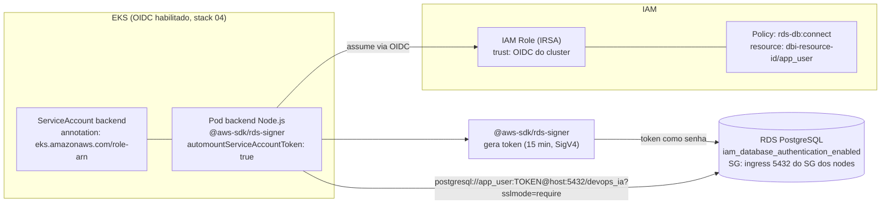

# ADR-0014: Conectividade EKS para RDS via IAM Database Authentication (IRSA)

## Status
Proposed

## Data
2026-05-30

## Contexto

O backend Node.js (Incident Tracker) roda como pods no cluster EKS `devops-ia-production` e precisa se conectar ao RDS PostgreSQL provisionado na ADR-0013. Duas decisoes de conectividade precisam ser tomadas:

1. **Network**: como permitir e restringir o trafego dos pods ate o RDS na porta 5432.
2. **Autenticacao no banco**: como o pod prova sua identidade ao Postgres sem armazenar uma senha estatica.

O usuario confirmou: **IAM Database Authentication via IRSA**, sem senha estatica para a aplicacao. O cluster ja possui um OIDC provider habilitado (stack 04), entao IRSA esta disponivel.

### Constraints levantados no discovery

- Cluster EKS com OIDC provider habilitado (`aws_iam_openid_connect_provider.eks` na stack 04).
- RDS em subnets privadas, `iam_database_authentication_enabled = true` (ADR-0013).
- O deployment atual do backend tem `automountServiceAccountToken: false`, **precisa mudar para `true`** para que o IRSA injete o token do ServiceAccount.
- Backend usa `@aws-sdk/...` ja no ecossistema Node.js; o pacote para gerar o token de auth e `@aws-sdk/rds-signer`.

### Validacoes via MCP

- **aws-mcp** ([Connecting using IAM authentication](https://docs.aws.amazon.com/AmazonRDS/latest/UserGuide/UsingWithRDS.IAMDBAuth.Connecting.html)): IAM DB auth permite conectar usando um **token temporario de autenticacao no lugar de senha**, com cada token **valido por 15 minutos** e exigindo assinatura AWS Signature Version 4. A AWS destaca o uso para evitar senhas hardcoded (ex.: a partir de Lambda), e os tokens podem ser gerados automaticamente via AWS CLI ou SDKs. Pre-requisitos: habilitar IAM DB auth, criar uma policy IAM apropriada e configurar uma conta de banco para autenticacao IAM.
- **aws-mcp** ([IAM database authentication](https://docs.aws.amazon.com/AmazonRDS/latest/AuroraUserGuide/UsingWithRDS.IAMDBAuth.html)): a abordagem e **recomendada para aplicacoes com menos de 200 conexoes por segundo**, oferece trafego de rede criptografado via SSL/TLS e gestao centralizada de acesso via IAM. O volume MVP do Incident Tracker esta muito abaixo desse limite, validando a escolha.

## Drivers da Decisao

- Eliminar credencial estatica de banco (sem senha em Secret/ConfigMap/Git para a aplicacao).
- Gestao centralizada de acesso via IAM, auditavel por CloudTrail.
- Trafego sempre sobre TLS (requisito reforcado por `rds.force_ssl = 1` da ADR-0013).
- Least privilege de rede: o RDS so aceita trafego dos nodes do cluster, por referencia de security group.

## Opcoes Consideradas

### Opcao A: IAM DB auth via IRSA, token gerado pelo backend (Recomendada)

- **Descricao**: O pod do backend usa um ServiceAccount com annotation `eks.amazonaws.com/role-arn` (IRSA). A role tem uma policy com `rds-db:connect` restrita ao DBUser `app_user`. O backend usa `@aws-sdk/rds-signer` para gerar o token de 15 min e o injeta como senha na connection string do Prisma, com refresh periodico antes da expiracao.
- **Pros**:
  - Sem senha estatica; credencial e um token efemero de 15 min.
  - Identidade do pod federada via OIDC/IRSA; rotacao automatica de credencial AWS subjacente.
  - Auditavel via CloudTrail (cada `rds-db:connect` e rastreavel).
  - Refresh totalmente no codigo da aplicacao, sem dependencia de init container.
- **Contras**:
  - Exige logica de refresh do token no backend (tokens expiram em 15 min; conexoes de longa duracao precisam reconectar com token novo).
  - Acopla a aplicacao ao SDK AWS (`@aws-sdk/rds-signer`).
- **Custo estimado**: US$ 0 adicional (IAM, IRSA e tokens nao tem custo).

### Opcao B: IAM DB auth via IRSA, token gerado por init container / startup script

- **Descricao**: Um init container (ou startup script antes do `node dist/index.js`) gera o token via `aws rds generate-db-auth-token` e monta o `DATABASE_URL` completo. O processo principal apenas le a variavel.
- **Pros**:
  - Mantem o codigo da aplicacao mais simples (sem SDK de assinatura embarcado).
  - Padrao familiar para quem ja usa init containers.
- **Contras**:
  - O token expira em 15 min, mas conexoes do pool vivem mais, sem refresh continuo, o init container resolve apenas o boot, nao a renovacao. Para pools de longa duracao isso quebra apos 15 min.
  - Exige um sidecar/processo de refresh de qualquer forma, anulando a simplicidade.
- **Custo estimado**: US$ 0 adicional.

### Opcao C: Senha estatica em K8s Secret (descartada)

- **Descricao**: Master/app password armazenada em Secret `backend-secrets`, injetada como `DATABASE_URL`.
- **Pros**:
  - Simples; sem SDK nem refresh.
- **Contras**:
  - **Credencial estatica de longa duracao**, exatamente o que o usuario quer evitar.
  - Rotacao manual (ou via Secrets Manager + ESO), com janela de exposicao maior.
  - Sem auditoria por conexao via CloudTrail.
- **Custo estimado**: US$ 0, mas com risco de seguranca inaceitavel para esta decisao. **Descartada.**

## Decisao

**Opcao A: IAM Database Authentication via IRSA, com token gerado pelo backend via `@aws-sdk/rds-signer` e refresh periodico.**

A connection string para IAM auth tera o formato:

```
postgresql://app_user:${TOKEN}@${DB_HOST}:5432/devops_ia?sslmode=require
```

onde `${TOKEN}` e o token de 15 min gerado pelo signer e `${DB_HOST}` e o endpoint do RDS (output da stack 05).

Justificativa contra os 6 pilares do AWS Well-Architected:

1. **Operational Excellence**: credencial gerida pelo proprio IAM; sem rotacao manual de senha. CloudTrail audita acessos. O refresh do token e codigo versionado e testavel.
2. **Security**: sem senha estatica de aplicacao. Token efemero (15 min). Policy `rds-db:connect` restrita ao DBUser `app_user` especifico (recurso ARN com o `dbi-resource-id` e usuario, **nunca `*`**). TLS obrigatorio (`sslmode=require` + `rds.force_ssl = 1`). Least privilege de rede via referencia de SG.
3. **Reliability**: refresh proativo do token (antes dos 15 min) evita falhas de reconexao. Volume MVP muito abaixo do limite de 200 conn/s recomendado pela AWS para IAM auth.
4. **Performance Efficiency**: geracao de token e local e barata; o pool do Prisma reaproveita conexoes; o overhead de auth e amortizado.
5. **Cost Optimization**: IAM, IRSA e tokens sao gratuitos. Sem custo de Secrets Manager para a credencial da aplicacao (master fica no Secrets Manager gerenciado, ADR-0013).
6. **Sustainability**: sem infra adicional (sem sidecar de proxy, sem servico de rotacao dedicado).

## Consequencias

- **Positivas**:
  - Zero senha estatica de aplicacao no Git, ConfigMap ou Secret.
  - Acesso ao banco federado por identidade do pod (IRSA), auditavel.
  - Segmentacao de rede por SG, sem CIDRs frageis.

- **Negativas / Trade-offs aceitos**:
  - **Impacto no codigo do backend**: precisa adicionar `@aws-sdk/rds-signer` e logica de refresh do token (estrategia: gerar token no boot e renovar a cada ~10 min, ou regenerar por conexao nova do pool). Esta mudanca de codigo deve ser registrada e implementada pelo time de aplicacao/engenharia.
  - Mudanca obrigatoria no deployment: `automountServiceAccountToken` de `false` para `true`.
  - Acoplamento ao SDK AWS no backend.

- **Riscos e mitigacoes**:
  - *Risco*: token expira durante uma conexao de longa duracao do pool. *Mitigacao*: refresh proativo (regenerar antes de 15 min) e `pool` do Prisma com `connection_limit` e reciclagem; reconectar com token novo em falha de auth.
  - *Risco*: `automountServiceAccountToken: true` aumenta superficie se o pod for comprometido. *Mitigacao*: a role IRSA tem apenas `rds-db:connect` ao DBUser especifico; nenhuma outra permissao.
  - *Risco*: policy com recurso `*` por engano. *Mitigacao*: revisao obrigatoria (Checkov/CODEOWNERS da ADR-0009); o ARN deve conter `dbi-<resource-id>/app_user`.

## Diagrama



## Implementation Guidelines (para o DevOps Engineer Agent)

- **IaC stack**: recursos IAM (role + policy IRSA) podem viver na stack `05-database-stack-ai` (junto ao RDS, pois dependem do `resource_id` do banco) ou em uma stack de addons. O SG de ingress do RDS fica na stack 05. Provider `hashicorp/aws ~> 6.0`.
- **Network (stack 05, `rds.security-group.tf`)**:
  - `aws_security_group` do RDS com `aws_vpc_security_group_ingress_rule` (ou bloco ingress) na porta 5432, `referenced_security_group_id` = SG dos nodes EKS (obtido via remote state da stack 02). **Referencia por SG ID, nunca por CIDR.**
- **IAM (IRSA)**:
  - `aws_iam_role` com assume-role policy federada ao OIDC provider do cluster, condicionada ao `sub` do ServiceAccount do backend (`system:serviceaccount:<namespace>:<backend-sa>`).
  - `aws_iam_policy` com action `rds-db:connect` e `Resource` no formato `arn:aws:rds-db:us-east-1:074994084847:dbuser:<dbi-resource-id>/app_user` (usar o `resource_id` output da stack 05; **nao usar `*`**).
- **Banco (executado uma vez, fora do Terraform, runbook ou Job)**:
  - Criar o usuario IAM no Postgres: `CREATE USER app_user; GRANT rds_iam TO app_user;` e os GRANTs de schema/tabelas necessarios.
- **Kubernetes (manifestos, produzidos pelo time de app, fora do escopo do architect)**:
  - ServiceAccount com annotation `eks.amazonaws.com/role-arn: <arn da role IRSA>`.
  - Deployment do backend: `automountServiceAccountToken: true` (mudar de `false`).
  - Backend monta `DATABASE_URL` em runtime usando o token do signer (nao via Secret estatico).
- **Variaveis e secrets necessarios**:
  - `DB_HOST` (endpoint do RDS, output da stack 05), pode vir de ConfigMap (nao e segredo).
  - `JWT_SECRET` continua em `backend-secrets` (ADR-0015), assunto separado da credencial de banco.
  - Sem `DATABASE_URL` estatico com senha.
- **Validacoes pos-deploy**:
  - Pod do backend conecta ao RDS e `/backend/health` retorna `{ db: "connected" }` (ADR-0017).
  - CloudTrail mostra eventos de uso da role IRSA.
  - Tentar conectar com a role sem a policy deve falhar (valida least privilege).
- **Rollback strategy**: se o IAM auth falhar em producao, fallback temporario para o master user via Secrets Manager (ADR-0013) enquanto se corrige a policy/refresh, documentado como contingencia, nao como modo permanente.

## Observabilidade e Day-2

- Monitorar `DatabaseConnections` (ADR-0017), auth IAM nao muda o limite de conexoes da classe `db.t3.micro`.
- Alertar em picos de falha de conexao (possivel token expirado / refresh quebrado).
- Runbook: como rotacionar/recriar a role IRSA e o DBUser `app_user`.

## Seguranca

- **IAM (least privilege)**: role IRSA com unica permissao `rds-db:connect` restrita ao DBUser `app_user` e ao `resource_id` do banco. Trust policy condicionada ao ServiceAccount especifico.
- **Criptografia**: TLS obrigatorio em transito (`sslmode=require`); token assinado via SigV4.
- **Network segmentation**: SG do RDS aceita 5432 apenas do SG dos nodes EKS, por referencia de SG.
- **Logging e auditoria**: CloudTrail registra assuncao de role e conexoes IAM ao banco.

## Custo Estimado

- **Mensal aproximado**: US$ 0 adicional (IAM, IRSA, tokens e regras de SG nao tem custo). O custo de banco esta na ADR-0013.
- **Principais drivers de custo**: nenhum direto.
- **Oportunidades de otimizacao futura**: usar RDS Proxy (custo adicional ~US$/hora) apenas se o volume de conexoes crescer e o pooling no Prisma deixar de ser suficiente.

## Referencias

- AWS Well-Architected: [Security Pillar](https://docs.aws.amazon.com/wellarchitected/latest/security-pillar/welcome.html)
- AWS RDS IAM authentication (validado via aws-mcp, tokens de 15 min): https://docs.aws.amazon.com/AmazonRDS/latest/UserGuide/UsingWithRDS.IAMDBAuth.Connecting.html
- AWS RDS IAM auth, recomendacao < 200 conn/s (validado via aws-mcp): https://docs.aws.amazon.com/AmazonRDS/latest/AuroraUserGuide/UsingWithRDS.IAMDBAuth.html
- ADRs relacionados: ADR-0004 (OIDC/IRSA base), ADR-0013 (RDS), ADR-0015 (JWT app), ADR-0016 (migrations precisam de acesso ao banco)
