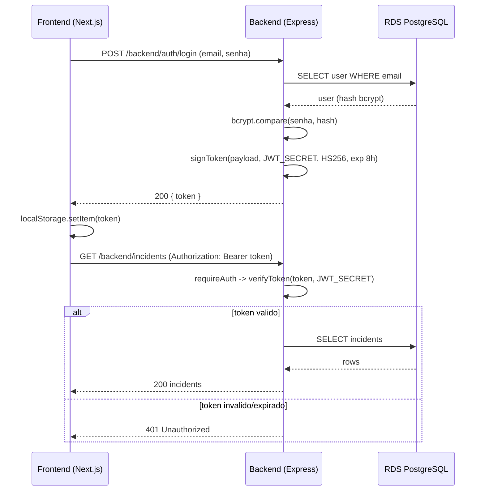

# ADR-0015: Autenticacao da Aplicacao com JWT stateless (HS256)

## Status
Accepted

## Data
2026-05-30

## Contexto

O backend Node.js (Incident Tracker) expoe rotas autenticadas sob `/backend`:

- `POST /backend/auth/register` e `POST /backend/auth/login` (publicas), emitem JWT.
- `GET/POST /backend/incidents`, `PATCH /backend/incidents/:id`, `GET /backend/dashboard/summary` (protegidas), exigem `Authorization: Bearer <jwt>`.

A autenticacao ja esta implementada com a biblioteca `jsonwebtoken`: `lib/jwt.ts` (`signToken`/`verifyToken`) e o middleware `middlewares/auth.ts` (`requireAuth`). As senhas dos usuarios sao armazenadas com hash `bcryptjs`. Esta ADR documenta e ratifica a decisao ja em codigo, alinhando-a aos pilares e aos guardrails de seguranca do projeto.

### Constraints levantados no discovery

- Single service: apenas o backend Node.js emite e valida o token (nao ha multiplos servicos consumindo o JWT nesta fase).
- A signing key deve viver no K8s Secret `backend-secrets` (`JWT_SECRET` via `secretKeyRef`), nunca em ConfigMap nem no Git.
- Frontend (Next.js) guarda o token em `localStorage` (`lib/auth.ts`) e envia via `apiFetch` com header Bearer (`lib/api.ts`), base `${NEXT_PUBLIC_API_URL}/backend`.

## Drivers da Decisao

- Autenticacao stateless adequada a um unico servico, sem store de sessao.
- Simplicidade de implementacao e operacao na Fase 1 (workshop/MVP).
- Segredo de assinatura fora do Git, injetado de forma segura no pod.

## Opcoes Consideradas

### Opcao A: JWT stateless HS256, segredo em K8s Secret (Recomendada e implementada)

- **Descricao**: Token assinado com HS256 (HMAC + SHA-256, chave simetrica). `JWT_SECRET` injetado do Secret `backend-secrets`. Expiracao de 8h (`JWT_EXPIRY`). Sem refresh token na Fase 1.
- **Pros**:
  - Simples: uma unica chave, suportada nativamente por `jsonwebtoken`.
  - Stateless: sem store de sessao, escala horizontalmente sem sticky sessions.
  - Adequado a single-service (so o backend assina e verifica).
- **Contras**:
  - Chave simetrica: quem verifica tambem pode assinar, aceitavel quando emissor e verificador sao o mesmo servico.
  - Sem revogacao imediata de token antes da expiracao (mitigado por expiracao curta de 8h).
- **Custo estimado**: US$ 0 (biblioteca open-source, sem servico externo).

### Opcao B: JWT com RS256 (par de chaves assimetrico)

- **Descricao**: Assinatura com chave privada, verificacao com chave publica.
- **Pros**:
  - Verificadores so precisam da chave publica, ideal quando multiplos servicos validam o token sem poder assina-lo.
- **Contras**:
  - Complexidade extra (gestao de par de chaves, JWKS) sem beneficio em arquitetura single-service.
  - Recomendado **apenas quando multiplos servicos consomem o token**, nao e o caso na Fase 1.
- **Custo estimado**: US$ 0, mas com overhead operacional desnecessario agora.

### Opcao C: Sessao server-side (store em Redis/banco)

- **Descricao**: Sessao stateful com identificador em cookie, estado no servidor.
- **Pros**:
  - Revogacao imediata de sessao.
- **Contras**:
  - Requer store adicional (Redis), que disputaria recursos no cluster `t3.small` ou adicionaria custo.
  - Stateful: complica escala horizontal.
- **Custo estimado**: custo de infra adicional, descartada para o MVP.

## Decisao

**Opcao A: JWT stateless com HS256, segredo em K8s Secret `backend-secrets`, expiracao de 8h, sem refresh token na Fase 1.**

Parametros:
- **Algoritmo**: HS256 (simetrico, adequado a single-service). RS256 fica recomendado apenas quando multiplos servicos passarem a consumir o token.
- **Expiracao**: 8h, configuravel via env var `JWT_EXPIRY`.
- **Refresh token**: nao implementado na Fase 1 (fluxo simplificado). Adicionado em Fase 2 se a UX exigir sessoes longas com renovacao silenciosa.
- **Signing key**: env var `JWT_SECRET` injetada do K8s Secret `backend-secrets` (nunca ConfigMap, nunca Git).

Justificativa contra os 6 pilares do AWS Well-Architected:

1. **Operational Excellence**: implementacao mínima e ja em codigo (`lib/jwt.ts`, `middlewares/auth.ts`). Sem store de sessao para operar.
2. **Security**: senhas com hash `bcryptjs`; segredo de assinatura fora do Git, em Secret K8s; expiracao curta (8h) limita a janela de uso de um token vazado. Gitleaks (ADR-0009) detecta vazamento acidental do `JWT_SECRET`.
3. **Reliability**: stateless permite que qualquer replica do backend valide qualquer token sem afinidade de sessao; tolera restart de pods sem perder login (ate a expiracao).
4. **Performance Efficiency**: verificacao HMAC e barata e local; sem round-trip a um store de sessao.
5. **Cost Optimization**: zero custo (sem Redis, sem servico de identidade gerenciado).
6. **Sustainability**: sem infra de sessao dedicada; reaproveita o proprio backend.

## Consequencias

- **Positivas**:
  - Auth funcional, stateless e barata, ja em producao no codigo.
  - Segredo isolado em Secret K8s, alinhado aos guardrails do projeto.
  - Escala horizontal trivial.

- **Negativas / Trade-offs aceitos**:
  - Sem revogacao imediata pre-expiracao (aceito; mitigado pela expiracao de 8h).
  - HS256 simetrico nao serve cenario multi-servico, exigira migracao para RS256 se a arquitetura crescer.
  - Token em `localStorage` no frontend e suscetivel a XSS, mitigacao depende de boas praticas no frontend (escapar conteudo, CSP); registrado como ponto de atencao para Fase 2 (considerar cookie httpOnly).

- **Riscos e mitigacoes**:
  - *Risco*: vazamento do `JWT_SECRET`. *Mitigacao*: Secret K8s (nao Git), Gitleaks no pipeline (ADR-0009); rotacao do segredo invalida todos os tokens (efeito colateral aceito).
  - *Risco*: segredo fraco. *Mitigacao*: gerar `JWT_SECRET` com alta entropia (>= 32 bytes aleatorios); validar via Semgrep `p/nodejs` (JWT misconfig, ADR-0009).
  - *Risco*: XSS no frontend rouba token do `localStorage`. *Mitigacao*: praticas de frontend + reavaliar storage (cookie httpOnly) na Fase 2.

## Diagrama

## Implementation Guidelines (para o DevOps Engineer Agent)

- **Codigo**: ja implementado (`lib/jwt.ts`, `middlewares/auth.ts`). Sem trabalho de IaC alem da gestao do Secret.
- **Secret `backend-secrets`** (Kubernetes):
  - Contem `JWT_SECRET` (e, separadamente, dados de banco quando aplicavel, ver ADR-0014, que prefere IAM auth sem senha).
  - **Nao gerenciado pelo ArgoCD** (evitar secret em Git). Criado manualmente via `kubectl create secret` OU provisionado via AWS Secrets Manager + External Secrets Operator (ESO). A escolha entre criacao manual e ESO esta deferida para a decisao de gestao de secrets associada a ADR-0014; nesta ADR fica registrado apenas que o segredo **nao vai para o Git**.
  - Injecao no deployment via `env.valueFrom.secretKeyRef`.
- **Geracao do segredo**: `openssl rand -base64 48` (>= 32 bytes de entropia).
- **Variaveis de ambiente do backend**: `JWT_SECRET` (secretKeyRef), `JWT_EXPIRY` (ex.: `8h`, pode vir de ConfigMap).
- **Validacoes pos-deploy**:
  - Login retorna token; chamada protegida com token valido retorna 200; sem token ou token expirado retorna 401.
  - Confirmar que `JWT_SECRET` nao aparece em ConfigMap, logs ou Git (Gitleaks).
- **Rollback strategy**: rotacionar `JWT_SECRET` invalida todos os tokens ativos (forca re-login); usar apenas em incidente de vazamento.

## Observabilidade e Day-2

- Logar (sem expor o token) eventos de 401 para detectar tentativas de acesso invalidas.
- Metrica opcional Fase 2: taxa de falhas de auth via `prom-client` (ADR-0017).
- Runbook: procedimento de rotacao do `JWT_SECRET` e impacto (re-login global).

## Seguranca

- **IAM**: N/A (auth de aplicacao, nao IAM). A credencial de banco e tratada na ADR-0014.
- **Criptografia**: HMAC-SHA256 para assinatura; segredo de alta entropia. TLS em transito ja garantido pelo Ingress/ALB (ADRs anteriores).
- **Network segmentation**: rotas publicas (`/auth/*`) vs protegidas (`requireAuth`); o middleware aplica o gate.
- **Logging e auditoria**: eventos de auth logados; segredo nunca logado.

## Custo Estimado

- **Mensal aproximado**: US$ 0 (biblioteca open-source, sem servico de identidade gerenciado, sem store de sessao).
- **Principais drivers de custo**: nenhum.
- **Oportunidades de otimizacao futura**: nenhuma de custo; evolucoes sao de seguranca (RS256 multi-servico, refresh token, cookie httpOnly).

## Referencias

- AWS Well-Architected: [Security Pillar, Identity and Access Management](https://docs.aws.amazon.com/wellarchitected/latest/security-pillar/identity-and-access-management.html)
- jsonwebtoken: https://github.com/auth0/node-jsonwebtoken
- OWASP JWT Cheat Sheet: https://cheatsheetseries.owasp.org/cheatsheets/JSON_Web_Token_for_Java_Cheat_Sheet.html
- ADRs relacionados: ADR-0009 (scan de JWT misconfig e secrets), ADR-0014 (credencial de banco via IRSA)
