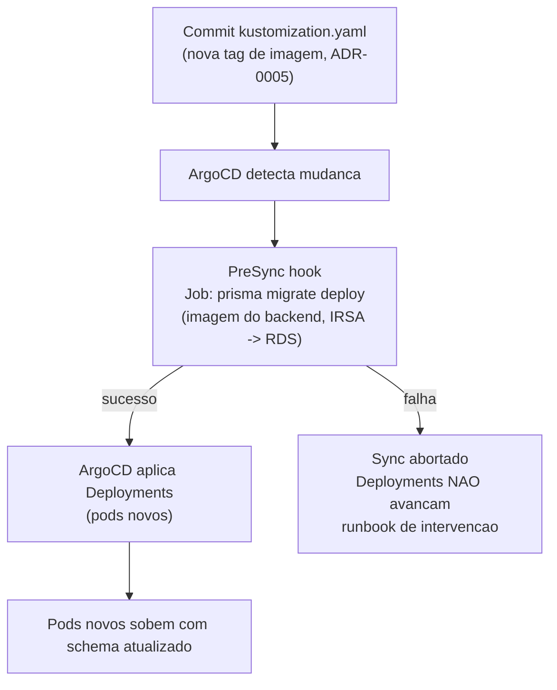

# ADR-0016: Database Migrations com Prisma no pipeline GitOps

## Status
Proposed

## Data
2026-05-30

## Contexto

O backend Node.js usa Prisma como ORM. O schema (`prisma/schema.prisma`) define `User`, `Incident` e os enums `Severity` (SEV1-SEV4) e `IncidentStatus` (OPEN/INVESTIGATING/RESOLVED). Conforme o schema evolui, o banco RDS PostgreSQL (ADR-0013) precisa receber as migrations correspondentes.

A questao desta ADR e **onde e como** as migrations Prisma rodam dentro do fluxo GitOps existente (CI no GitHub Actions, CD via ArgoCD, ADR-0005 e ADR-0006), garantindo que o schema do banco esteja atualizado **antes** dos novos pods de aplicacao subirem.

### Constraints levantados no discovery

- O deploy e GitOps: o CI faz build/push e atualiza `kustomization.yaml`; o ArgoCD sincroniza (ADR-0005, ADR-0006). A pipeline de CI **nao** faz deploy direto no cluster.
- O RDS esta em subnet privada; o acesso ao banco e via IAM auth/IRSA (ADR-0014). O runner do GitHub Actions **nao** tem rota de rede ate o banco.
- A imagem do backend ja contem o Prisma Client e o schema (gerados em build time).

### Validacoes via MCP

- Prisma e ferramenta de aplicacao (nao um servico AWS), entao nao requer validacao via aws-mcp. O acesso de rede do Job ao RDS reaproveita o padrao IRSA validado na ADR-0014.

## Drivers da Decisao

- Schema atualizado **antes** dos novos Deployments (evitar pod novo batendo em schema antigo).
- Manter o ciclo GitOps coeso (ArgoCD como orquestrador do que entra no cluster).
- Nao dar ao runner de CI acesso de rede ao banco de producao.
- Migrations deterministicas e auditaveis.

## Opcoes Consideradas

### Opcao A: Job Kubernetes como ArgoCD PreSync hook (Recomendada)

- **Descricao**: Um `Job` Kubernetes anotado com `argocd.argoproj.io/hook: PreSync` roda `npx prisma migrate deploy` antes do ArgoCD aplicar os Deployments. A imagem do Job e a **mesma imagem do backend** (ja tem Prisma Client + schema). O Job acessa o RDS via IRSA (ADR-0014).
- **Pros**:
  - Schema migrado antes dos pods novos subirem (ordem garantida pelo hook PreSync).
  - Dentro do ciclo GitOps, ArgoCD orquestra; nada acessa o banco de fora do cluster.
  - Reaproveita a imagem do backend e o IRSA da ADR-0014.
  - Falha de migration aborta o sync (Deployments nao avancam com schema inconsistente).
- **Contras**:
  - Exige hook policies (`hook-delete-policy`) bem configuradas para limpeza dos Jobs.
  - Migration longa atrasa o sync (aceitavel; migrations de MVP sao rapidas).
- **Custo estimado**: US$ 0 adicional (roda no cluster existente, efemero).

### Opcao B: Init container no pod do backend

- **Descricao**: Um init container roda `prisma migrate deploy` antes do container principal de cada pod.
- **Pros**:
  - Simples de declarar no Deployment.
- **Contras**:
  - **Cada replica** tenta migrar no boot, corrida entre pods (Prisma usa advisory lock, mas ainda complica o pod).
  - Bloqueia todos os pods durante a migration; rollout fica acoplado a migration.
  - Migration repetida em scale-up/restart de pods.
- **Custo estimado**: US$ 0, mas com acoplamento e corrida indesejados. Descartada.

### Opcao C: Step no pipeline de CI/CD (GitHub Actions)

- **Descricao**: Um step do workflow roda `prisma migrate deploy` apontando para o RDS.
- **Pros**:
  - Centraliza no CI.
- **Contras**:
  - **Acopla o CI ao banco de producao** (runner precisaria de rota de rede ate o RDS privado, quebra a segmentacao da ADR-0014).
  - Fora do ciclo GitOps (migration aconteceria antes/independente do sync do ArgoCD).
  - Credencial/acesso ao banco a partir de um runner externo aumenta a superficie.
- **Custo estimado**: US$ 0, mas viola a segmentacao de rede e o modelo GitOps. Descartada.

## Decisao

**Opcao A: Job Kubernetes como ArgoCD PreSync hook, rodando `prisma migrate deploy` com a imagem do backend e acesso ao RDS via IRSA.**

Ferramenta: **`prisma migrate deploy`** (deterministico, aplica migrations ja commitadas; adequado para CI/CD). **Nunca** `prisma migrate dev` (interativo, gera migrations, so para desenvolvimento local).

Estrategia de rollback de schema: **expand/contract**, mudancas aditivas (ADD column/table) primeiro, mudancas destrutivas (DROP) apenas apos a versao da aplicacao que nao usa mais a estrutura estar estavel. Documentado como **guideline**, nao como enforcement automatico.

Justificativa contra os 6 pilares do AWS Well-Architected:

1. **Operational Excellence**: migration deterministica, versionada em Git, orquestrada pelo ArgoCD. Falha aborta o sync, sinalizando o problema antes do rollout.
2. **Security**: o Job roda no cluster e acessa o RDS via IRSA (ADR-0014), nenhum acesso ao banco a partir de runner externo. Sem credencial estatica.
3. **Reliability**: ordem PreSync garante schema pronto antes dos pods. Expand/contract mantem compatibilidade com a imagem anterior, viabilizando rollback de imagem (ADR-0005) sem quebrar o banco.
4. **Performance Efficiency**: Job efemero, roda uma vez por sync; sem overhead permanente.
5. **Cost Optimization**: zero custo adicional (cluster existente, Job efemero).
6. **Sustainability**: recurso efemero, limpo apos sucesso via hook-delete-policy; sem processo permanente.

## Consequencias

- **Positivas**:
  - Schema sempre atualizado antes dos pods novos.
  - GitOps coeso; banco so acessado de dentro do cluster.
  - Reaproveita imagem do backend e IRSA.

- **Negativas / Trade-offs aceitos**:
  - Hook PreSync adiciona uma etapa ao sync (latencia pequena no deploy).
  - Expand/contract e disciplina manual (guideline), nao garantida por automacao, exige revisao de PR.
  - Migration que falha bloqueia o deploy (comportamento desejado, mas exige runbook de intervencao).

- **Riscos e mitigacoes**:
  - *Risco*: migration destrutiva quebra a imagem anterior em rollback. *Mitigacao*: expand/contract (DROP so apos versao estavel); revisao de PR para migrations.
  - *Risco*: Job sem permissao de banco (IRSA mal configurada). *Mitigacao*: o Job usa o mesmo ServiceAccount/role do backend (ADR-0014) com `rds-db:connect`; o DBUser precisa de privilegios DDL.
  - *Risco*: migrations concorrentes (dois syncs simultaneos). *Mitigacao*: Prisma usa advisory lock no banco; ArgoCD serializa o sync da Application.

## Diagrama

## Implementation Guidelines (para o DevOps Engineer Agent)

- **Manifesto do Job** (em `devops-ia-kubernetes/backend/` ou diretorio de migrations):
  - `kind: Job` com annotations:
    - `argocd.argoproj.io/hook: PreSync`
    - `argocd.argoproj.io/hook-delete-policy: HookSucceeded` (limpa o Job apos sucesso; manter em falha para diagnostico)
  - `spec.template`: imagem = mesma do backend (mesma tag controlada pelo kustomization), comando `npx prisma migrate deploy`.
  - ServiceAccount = o mesmo do backend (com IRSA da ADR-0014) para acesso ao RDS.
  - `automountServiceAccountToken: true` (necessario para IRSA).
  - `DB_HOST` via ConfigMap; `DATABASE_URL` montado em runtime com token IAM (ADR-0014). O DBUser usado pelo Job precisa de privilegios DDL no banco.
  - `restartPolicy: Never`, `backoffLimit` baixo (ex.: 2), `securityContext` conforme `.claude/rules/kubernetes-manifests.md` (runAsNonRoot, readOnlyRootFilesystem, etc.).
- **Imagem**: o Dockerfile do backend ja deve incluir `prisma/` (schema + migrations) e o Prisma Client gerado (`npx prisma generate` em build time).
- **Ordem de execucao e dependencias**: depende de ADR-0013 (RDS existente) e ADR-0014 (IRSA e SG permitindo o Job acessar o banco). O Job roda antes dos Deployments via PreSync.
- **Variaveis e secrets**: `DB_HOST` (ConfigMap), sem senha estatica (IAM auth). Nenhum segredo novo.
- **Validacoes pos-deploy**:
  - `prisma migrate status` reporta o banco em dia.
  - O Job PreSync completa com `Succeeded` antes do sync dos Deployments.
  - `/backend/health` retorna `{ db: "connected" }` apos o rollout (ADR-0017).
- **Rollback strategy**: migrations sao forward-only. Para reverter, criar uma nova migration que desfaz a mudanca (compensatoria) e seguir expand/contract. Rollback de imagem (ADR-0005) so e seguro se a migration foi aditiva (compativel com a versao anterior).

## Observabilidade e Day-2

- Logs do Job PreSync vao para o CloudWatch via Fluent Bit (ADR-0008).
- Alertar se o Job PreSync falhar repetidamente (deploy travado).
- Runbook: como diagnosticar/destravar uma migration falha (inspecionar logs do Job, `prisma migrate status`, intervencao manual no banco se necessario).

## Seguranca

- **IAM**: Job usa IRSA (ADR-0014) com `rds-db:connect`; DBUser com privilegios DDL apenas o necessario.
- **Criptografia**: TLS ao banco (`sslmode=require`).
- **Network segmentation**: Job roda no cluster; banco nunca acessado de fora.
- **Logging e auditoria**: logs do Job centralizados (ADR-0008); CloudTrail audita o acesso IAM ao banco.

## Custo Estimado

- **Mensal aproximado**: US$ 0 adicional (Job efemero no cluster existente).
- **Principais drivers de custo**: nenhum.
- **Oportunidades de otimizacao futura**: nenhuma de custo.

## Referencias

- AWS Well-Architected: [Operational Excellence Pillar](https://docs.aws.amazon.com/wellarchitected/latest/operational-excellence-pillar/welcome.html)
- Prisma Migrate em producao (`migrate deploy`): https://www.prisma.io/docs/orm/prisma-migrate/workflows/development-and-production
- ArgoCD Resource Hooks: https://argo-cd.readthedocs.io/en/stable/user-guide/resource_hooks/
- ADRs relacionados: ADR-0005 (CI/CD), ADR-0006 (ArgoCD), ADR-0013 (RDS), ADR-0014 (IRSA para o Job)
