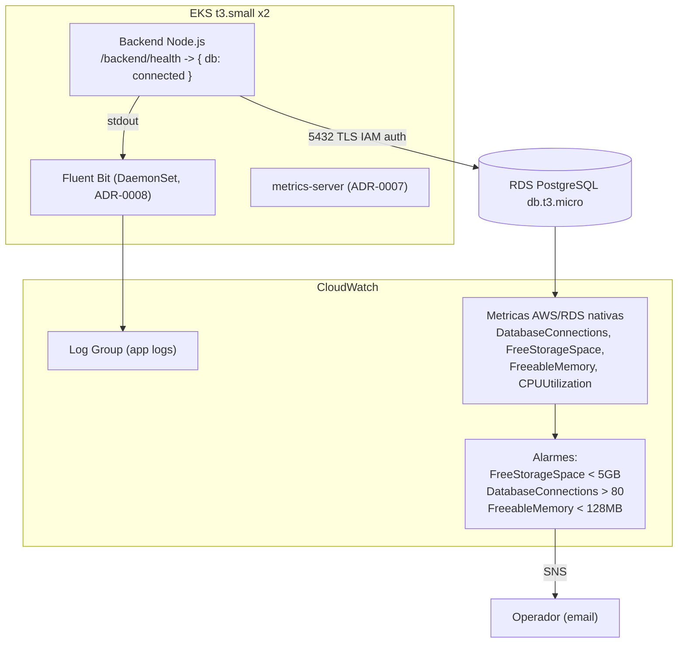

# ADR-0017: Observabilidade da aplicacao Node.js e do RDS PostgreSQL

## Status
Proposed

## Data
2026-05-30

## Contexto

Com a chegada da aplicacao real (backend Node.js + Prisma) e do banco RDS PostgreSQL (ADR-0013), a observabilidade precisa cobrir duas novas superficies que nao existiam quando o backend era um placeholder sem banco:

1. **Saude da aplicacao Node.js**, incluindo a conectividade ao banco.
2. **Saude do RDS**, conexoes, memoria, disco, CPU.

Esta ADR estende a estrategia free-tier-first ja decidida: metrics-server no cluster (ADR-0007) e logs centralizados via Fluent Bit para CloudWatch (ADR-0008). O objetivo e adicionar visibilidade de app e banco **sem sair do free tier** (ou com custo minimo), respeitando a restricao de capacidade dos nodes `t3.small` e do credito de US$ 100.

### Constraints levantados no discovery

- Cluster `t3.small x2` com margem de RAM apertada (ADR-0007), nada de stack pesado de observabilidade agora.
- CloudWatch free tier: 10 metricas custom, 10 alarmes, 3 dashboards, 5 GB de logs/mes.
- RDS `db.t3.micro` (1 GiB RAM) suporta ~80-90 conexoes, limite a ser monitorado.
- Backend ja expoe `/backend/health` que checa conectividade ao banco, retornando `{ db: "connected" | "disconnected" }`.

### Validacoes via MCP

- **aws-mcp** ([CloudWatch Pricing](https://aws.amazon.com/cloudwatch/pricing/), conforme validado na ADR-0007): metricas nativas do RDS (a cada 1 min) e alarmes basicos cabem no free tier; Container Insights e custom metrics em volume saem do free tier. As metricas `DatabaseConnections`, `FreeStorageSpace`, `FreeableMemory`, `CPUUtilization` sao **metricas nativas gratuitas** do RDS no namespace `AWS/RDS`.

## Drivers da Decisao

- Detectar precocemente esgotamento de conexoes, disco cheio e pressao de memoria no RDS.
- Tornar a saude da app visivel (health check com status do banco).
- Custo zero ou minimo; sem footprint relevante no cluster.

## Opcoes Consideradas

### Opcao A: CloudWatch nativo do RDS + health check da app + logs via Fluent Bit (Recomendada)

- **Descricao**: Usar as metricas nativas gratuitas do RDS com CloudWatch Alarms para os limites criticos; manter o `/backend/health` como readiness/liveness e como sinal de conectividade ao banco; logs do Node.js seguem para o CloudWatch Log Group existente via Fluent Bit (ADR-0008). Prometheus/Grafana ficam para o roadmap (ADR-0007).
- **Pros**:
  - Custo zero/minimo (metricas RDS nativas gratuitas; poucos alarmes dentro do free tier).
  - Sem footprint no cluster (metricas vem do lado AWS; logs reaproveitam Fluent Bit existente).
  - Cobre os riscos criticos do `db.t3.micro` (conexoes, disco, memoria).
- **Contras**:
  - Sem dashboards ricos de aplicacao (latencia P95/P99 por rota) nesta fase.
  - Metricas de aplicacao (Prometheus exposition) ficam para a Fase 2.
- **Custo estimado**: ~US$ 0 (dentro do free tier de alarmes; metricas RDS nativas gratuitas).

### Opcao B: CloudWatch Container Insights / Database Insights

- **Descricao**: Habilitar Container Insights no cluster e/ou Database Insights (`advanced`) no RDS.
- **Pros**:
  - Dashboards prontos, correlacao de metricas, drill-down.
- **Contras**:
  - **Fora do free tier** (validado na ADR-0007): custo recorrente por metrica/ingestao; Database Insights advanced tambem e cobrado.
  - Footprint do CloudWatch agent (Container Insights) disputa RAM no `t3.small`.
- **Custo estimado**: ~US$ 5-15/mes, descartada na fase free-tier.

### Opcao C: prom-client + Prometheus stack agora

- **Descricao**: Instrumentar o backend com `prom-client` e subir Prometheus/Grafana.
- **Pros**:
  - Metricas de aplicacao ricas, PromQL, alerting flexivel.
- **Contras**:
  - Prometheus stack nao cabe com folga no `t3.small` (ADR-0007), risco de OOM.
- **Custo estimado**: ~US$ 2-5/mes de EBS, mas inviavel por capacidade agora. Fica para o roadmap.

## Decisao

**Opcao A: CloudWatch nativo do RDS (metricas gratuitas + alarmes) + `/backend/health` da aplicacao + logs do Node.js via Fluent Bit para o CloudWatch Log Group existente (ADR-0008).**

Justificativa contra os 6 pilares do AWS Well-Architected:

1. **Operational Excellence**: alarmes acionaveis sobre os limites criticos do banco; health check expoe a dependencia app-banco. Logs centralizados ja existentes (ADR-0008).
2. **Security**: sem novos endpoints expostos; metricas vem do plano de controle da AWS. Logs sem dados sensiveis (sem token/segredo nos logs).
3. **Reliability**: alarmes antecipam os tres modos de falha mais provaveis do `db.t3.micro` (conexoes esgotadas, disco cheio, pressao de memoria), permitindo acao antes da indisponibilidade.
4. **Performance Efficiency**: metricas nativas a cada 1 min sem agente; sem overhead no cluster.
5. **Cost Optimization**: zero/minimo, metricas RDS nativas gratuitas, alarmes dentro do free tier, logs reaproveitando o pipeline existente.
6. **Sustainability**: sem stack adicional ocioso; reaproveita Fluent Bit e CloudWatch ja em uso.

### Metricas e alarmes

App:
- Endpoint `/backend/health` (ja implementado) checa conectividade ao banco e retorna `{ db: "connected" | "disconnected" }`. Usado como readinessProbe/livenessProbe (conforme `.claude/rules/kubernetes-manifests.md`).

RDS (namespace `AWS/RDS`, metricas nativas gratuitas):
- `DatabaseConnections`, `FreeableMemory`, `FreeStorageSpace`, `CPUUtilization`.

Alarmes criticos (CloudWatch Alarms):

| Alarme | Condicao | Razao |
|---|---|---|
| `RDS-FreeStorageSpace-Low` | `FreeStorageSpace < 5 GB` | Risco de disco cheio (20 GiB alocados), banco para de aceitar escrita. |
| `RDS-DatabaseConnections-High` | `DatabaseConnections > 80` | `db.t3.micro` suporta ~87 conexoes max; perto do teto. |
| `RDS-FreeableMemory-Low` | `FreeableMemory < 128 MB` | Pressao de memoria no `db.t3.micro` (1 GiB), risco de swap/instabilidade. |

(Tres alarmes, dentro dos 10 do free tier; reaproveita a folga ja prevista na ADR-0007.)

## Consequencias

- **Positivas**:
  - Visibilidade dos riscos criticos do banco com custo ~zero.
  - Health check torna a dependencia app-banco observavel e acionavel (probes).
  - Logs da app centralizados sem novo tooling.

- **Negativas / Trade-offs aceitos**:
  - Sem metricas de latencia por rota / SLO de aplicacao nesta fase (deferido a Fase 2 com `prom-client`).
  - Sem dashboards visuais ricos (CloudWatch dashboards basicos apenas; metrics-server via `kubectl top` para o cluster).
  - Alarmes por email/SNS, nao por PagerDuty (consistente com ADR-0007).

- **Riscos e mitigacoes**:
  - *Risco*: alarme de conexoes dispara tarde demais. *Mitigacao*: connection pool conservador no Prisma (ADR-0013) + threshold em 80 (margem antes de ~87).
  - *Risco*: log volume excede 5 GB/mes do free tier. *Mitigacao*: nivel de log adequado (sem debug em producao), retencao controlada no Log Group (ADR-0008).

## Diagrama

## Implementation Guidelines (para o DevOps Engineer Agent)

- **IaC**: alarmes CloudWatch como `aws_cloudwatch_metric_alarm` (provider `hashicorp/aws ~> 6.0`), preferencialmente na stack `05-database-stack-ai` (junto ao RDS, referenciando o `db_instance_identifier` via dimensao `DBInstanceIdentifier`).
- **Recursos**:
  - 3x `aws_cloudwatch_metric_alarm` (namespace `AWS/RDS`, dimensao `DBInstanceIdentifier`), com `alarm_actions` apontando para um `aws_sns_topic` (email subscription).
  - Opcional: `enabled_cloudwatch_logs_exports = ["postgresql"]` no `aws_db_instance` (ADR-0013) para logs do Postgres no CloudWatch.
- **App / Kubernetes** (fora do escopo do architect, registrado como guideline):
  - `readinessProbe` e `livenessProbe` apontando para `/backend/health` (porta 3001).
  - Logs em stdout (ja coletados pelo Fluent Bit, ADR-0008); nivel `info` em producao.
- **Ordem e dependencias**: depende de ADR-0013 (RDS existente) e ADR-0008 (Fluent Bit/Log Group). Estende ADR-0007 (free-tier).
- **Validacoes pos-deploy**:
  - `/backend/health` retorna `{ db: "connected" }` com o RDS no ar e `disconnected`/erro quando o banco esta indisponivel.
  - Os 3 alarmes aparecem em `ALARM`/`OK` corretamente (testar reduzindo threshold temporariamente ou via `set-alarm-state`).
  - Logs da app visiveis no Log Group do CloudWatch.
- **Rollback strategy**: alarmes e SNS sao removiveis via `terraform destroy` da stack 05 sem impacto na app.

## Observabilidade e Day-2

- Operacao do cluster continua via `kubectl top` (metrics-server, ADR-0007).
- Runbook: o que fazer em cada alarme (disco cheio -> aumentar `allocated_storage`/limpar; conexoes altas -> revisar pool/queries; memoria baixa -> revisar workload/considerar upgrade de classe).
- Backup/DR do banco: backups automaticos de 7 dias + PITR (ADR-0013).

### Roadmap (Fase 2, opcional)

- Instrumentar o backend com `prom-client` para expor `/metrics` (Prometheus exposition), **sem custo**, adicionar quando o cluster tiver Prometheus stack (gatilho da ADR-0007: upgrade para `t3.medium`+).
- Dashboards de SLO (latencia P95/P99, taxa de erro, error budget) quando o Prometheus stack existir.

## Seguranca

- **IAM**: alarmes e SNS sem permissoes sensiveis; SNS topic com policy restrita.
- **Criptografia**: logs no CloudWatch (criptografia em repouso default); SNS pode usar KMS se necessario.
- **Network segmentation**: N/A (metricas via plano de controle AWS).
- **Logging e auditoria**: logs centralizados (ADR-0008); sem segredos/tokens nos logs.

## Custo Estimado

- **Mensal aproximado**: ~US$ 0 (metricas RDS nativas gratuitas; 3 alarmes dentro dos 10 do free tier; logs dentro dos 5 GB/mes do free tier, reaproveitando ADR-0008). SNS: primeiras 1.000 notificacoes/mes por email gratuitas.
- **Principais drivers de custo**: volume de logs se exceder 5 GB/mes; alarmes alem de 10.
- **Oportunidades de otimizacao futura**: consolidar dashboards quando Prometheus chegar (Fase 2); ajustar retencao de logs.

## Referencias

- AWS Well-Architected: [Operational Excellence Pillar](https://docs.aws.amazon.com/wellarchitected/latest/operational-excellence-pillar/welcome.html)
- AWS CloudWatch Pricing (validado via aws-mcp na ADR-0007): https://aws.amazon.com/cloudwatch/pricing/
- Amazon RDS CloudWatch metrics: https://docs.aws.amazon.com/AmazonRDS/latest/UserGuide/monitoring-cloudwatch.html
- ADRs relacionados: ADR-0007 (metrics-server free-tier), ADR-0008 (logs/Fluent Bit), ADR-0013 (RDS)
