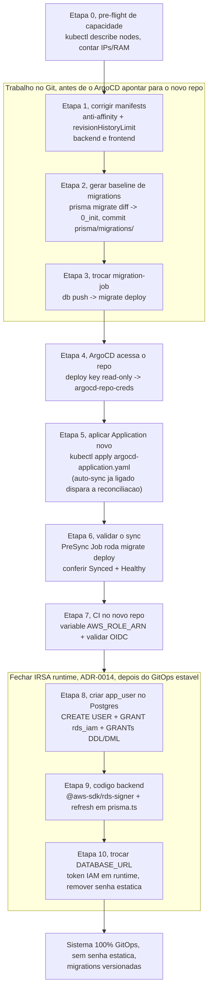

# ADR-0018: Execução da Fase 1, ativar GitOps, fechar IRSA no runtime e migrar para Prisma migrate deploy

## Status
Accepted

## Data
2026-05-30

## Contexto

O sistema `devops-ia` (Incident Tracker) está deployado e funcional no cluster EKS `devops-ia-production` (4 nodes t3.small, conta `074994084847`, us-east-1). O `STATUS.md` na raiz do repositório descreve o estado real: backend e frontend rodando (2 pods cada), RDS PostgreSQL 16 aplicado, ALB roteando, e schema do banco criado via `prisma db push`.

Porém o sistema chegou nesse estado por uma sequência de intervenções manuais de emergência (debug de CNI, troca de repositório Git, criação de Secrets fora do Git, ajuste de capacidade de node). O resultado é um ambiente que **funciona mas não está governado por GitOps de forma íntegra**, e que carrega três dívidas que as ADRs já aprovaram mas que ainda não foram fechadas:

1. **GitOps não está fechando o loop**: o repositório foi migrado para `SalesFX/eks-sre-devops-platform` (privado), o `argocd-application.yaml` foi atualizado para apontar para ele na branch `clean-main`, mas o Application ainda não foi reaplicado no cluster e o ArgoCD não tem credencial para clonar um repo privado. O bloco `automated: {prune: true, selfHeal: true}` permanece no manifest e é mantido ligado, este é um ambiente de portfólio, não produção crítica, e a simplicidade do auto-sync sempre ativo vale mais que cautela extra de ligar/desligar.
2. **CI não existe no novo repo**: o GitHub Actions (ADR-0005) precisa do `AWS_ROLE_ARN` configurado no novo repositório para voltar a buildar, escanear (ADR-0009) e atualizar o `kustomization.yaml`.
3. **Decisões aprovadas não fechadas no runtime**: a ADR-0014 (IRSA para o RDS) tem o lado de infraestrutura provisionado (role IRSA, ServiceAccount anotado, SG do RDS), mas o código Node.js ainda usa senha estática (`DATABASE_URL` no Secret `backend-secrets`). A ADR-0016 (`prisma migrate deploy`) ainda não vigora, o Job usa `prisma db push --accept-data-loss`. E os manifests dos Deployments violam duas regras obrigatórias do projeto (anti-affinity e `revisionHistoryLimit`).

Esta ADR **não introduz arquitetura nova**. Ela é um documento de execução que consolida e ordena os próximos passos operacionais da Fase 1, todos derivados de decisões já tomadas em ADRs anteriores, para entregar ao `devops-senior-engineer` um plano executável com dependências explícitas. As decisões confirmadas pelo usuário que motivam este documento:

- **A1**: marcar a ADR-0007 do kube-prometheus-stack como `Superseded` pela ADR-0007 free-tier (metrics-server). Feito neste mesmo ciclo.
- **B1**: migrar **já** para `prisma migrate deploy` (executar ADR-0016 junto com a Fase 1), gerando a baseline de migrations a partir do schema atual **antes** do próximo sync do ArgoCD.

### Estado atual verificado (lido do repositório em 2026-05-30)

| Item | Estado no Git | Estado no cluster (por STATUS.md) | Gap |
|---|---|---|---|
| `argocd-application.yaml` | aponta para `eks-sre-devops-platform`, branch `clean-main`, `path: devops-ia-kubernetes`, `automated: {prune: true, selfHeal: true}` | Application antiga ainda aplicada apontando para o repo velho | reaplicar o Application (mantendo `automated` como está) |
| Credencial do ArgoCD para o repo | não há (repo privado) | sem credencial | criar `argocd-repo-creds` (deploy key read-only) |
| GitHub Actions no novo repo | workflows presentes em `.github/workflows/` | variable `AWS_ROLE_ARN` não configurada no repo novo | configurar variable + validar OIDC |
| `backend/deployment.yaml` | `replicas: 2`, sem `podAntiAffinity`, sem `revisionHistoryLimit` | rodando | adicionar anti-affinity + revisionHistoryLimit |
| `frontend/deployment.yaml` | `replicas: 2`, sem `podAntiAffinity`, sem `revisionHistoryLimit` | rodando | adicionar anti-affinity + revisionHistoryLimit |
| `migration-job.yaml` | `npx prisma db push --skip-generate --accept-data-loss`, lê `DATABASE_URL` do Secret | rodou como `Completed` | trocar por `prisma migrate deploy`, exige baseline de migrations |
| `prisma/migrations/` | **não existe** (só `schema.prisma`) | n/a | gerar baseline `0_init` a partir do schema atual |
| `backend/serviceaccount.yaml` | anotado com `eks.amazonaws.com/role-arn: ...backend-irsa` | aplicado | ok, lado infra pronto |
| `deployment.yaml` IRSA | `automountServiceAccountToken: true`, mas `DATABASE_URL` vem de Secret estático | senha estática em uso | trocar geração de token (runtime) |
| `src/lib/prisma.ts` | `new PrismaClient()` puro, sem signer | senha estática | adicionar `@aws-sdk/rds-signer` + refresh |
| `app_user` no PostgreSQL | n/a | não criado (usa master) | `CREATE USER app_user; GRANT rds_iam` |

### ADRs que esta execução fecha

- **ADR-0006** (ArgoCD GitOps): reativar o loop GitOps de forma íntegra.
- **ADR-0005** (Pipeline CI/CD) e **ADR-0009** (security scans): CI funcional no novo repo.
- **ADR-0012** (estratégia de repositório): permanece monorepo na Fase 1, esta execução é a "refatoração interna" da Fase 1, não a migração 3-repo (Fase 2).
- **ADR-0014** (IRSA para RDS): fechar o lado runtime.
- **ADR-0016** (Prisma migrate deploy): substituir `db push` por `migrate deploy` com baseline.
- Regras `kubernetes-manifests.md`: anti-affinity obrigatória e `revisionHistoryLimit: 3`.

### Validações via MCP

- Esta ADR não introduz serviço AWS novo nem provider/módulo Terraform novo, todos já foram validados nas ADRs de origem (ADR-0014 validou IAM DB auth e o limite de tokens de 15 min via aws-mcp; ADR-0013 validou o RDS). Portanto não há nova consulta obrigatória de aws-mcp ou terraform-mcp para *decidir*. O `devops-senior-engineer`, ao **implementar**, deve revalidar versões de provider/recurso via terraform-mcp se tocar em IaC, e confirmar via aws-mcp o formato do ARN `rds-db:connect` (já registrado na ADR-0014).

## Drivers da Decisão

- Fechar o loop GitOps de forma íntegra, todo estado do cluster passa a vir do Git, sem `kubectl apply` manual persistente.
- Eliminar a credencial estática de banco (senha do master em `backend-secrets`) conforme ADR-0014.
- Ter histórico de migrations versionado e determinístico (ADR-0016), removendo o `--accept-data-loss` perigoso.
- Conformar os Deployments às regras obrigatórias do projeto (anti-affinity, revisionHistoryLimit) sem causar IP exhaustion ou rollout travado.
- Sequência segura, ordem com dependências explícitas para que nenhuma etapa quebre o ambiente que já está no ar.

## Sequência de Execução (ordem obrigatória, com dependências)

A ordem abaixo é desenhada para que cada etapa só rode quando suas pré-condições existirem. O princípio central, **antes de apontar o ArgoCD para o novo repo, todos os manifests no Git já devem estar corretos**, porque o Application tem `automated: {prune: true, selfHeal: true}` e qualquer manifest no Git vira realidade no cluster em segundos. Se o Git tiver um manifest quebrado (ex.: Job de migration apontando para `migrate deploy` sem que a baseline de migrations exista, ou sem `app_user` no banco), o primeiro sync vai falhar e pode travar o rollout. Por isso o trabalho no Git (Etapas 1 a 3) e a credencial do repo (Etapa 4) precedem o apply do Application novo (Etapa 5), que com auto-sync ligado dispara a reconciliação imediatamente.



### Por que esta ordem

1. **Capacidade primeiro** (Etapa 0): antes de mexer em qualquer Deployment, confirmar que o cluster comporta as mudanças. Anti-affinity não cria pods novos, mas o ciclo todo (migration Job + rollout) precisa de IPs livres. Acúmulo de pods `Terminating`/`Pending` é a causa mais comum de IP exhaustion neste cluster.
2. **Manifests corretos antes de o ArgoCD apontar para o novo repo** (Etapas 1 a 3): o Application tem `selfHeal: true` ligado, então o Git é lei a partir do primeiro sync. Tudo que será sincronizado precisa estar correto e consistente **no Git** antes do apply do Application (Etapa 5). A baseline de migrations (Etapa 2) precisa existir **antes** de trocar o Job (Etapa 3), senão o `migrate deploy` não tem o que aplicar e o PreSync hook falha, abortando o sync.
3. **ArgoCD precisa de acesso ao repo antes de qualquer sync** (Etapa 4 antes da 5/6): o repo é privado; sem credencial o ArgoCD nem consegue clonar, o Application fica `Unknown`/`ComparisonError`. A credencial é pré-condição absoluta de tudo que é GitOps.
4. **Validar o primeiro sync** (Etapa 6): com o auto-sync ligado, aplicar o Application (Etapa 5) já dispara a reconciliação. A Etapa 6 é a observação desse primeiro sync, acompanhar o PreSync Job (`migrate deploy`) completar e a Application ficar `Synced + Healthy`. Como os manifests e a baseline já estão corretos no Git (Etapas 1 a 3), o sync converge limpo. Se algo falhar, corrigir o Git, o `selfHeal` reconcilia sozinho assim que o commit chega.
5. **CI depois do GitOps estável** (Etapa 7): o CI atualiza o `kustomization.yaml` e o ArgoCD sincroniza. Ligar o CI antes do GitOps estar íntegro faria o pipeline commitar mudanças que o ArgoCD não conseguiria aplicar de forma confiável.
6. **IRSA runtime por último** (Etapas 8 a 10): é a mudança de maior risco (toca código de aplicação e autenticação no banco). Fazê-la depois que o GitOps está fechado garante rollback trivial (reverter o commit do código + voltar a imagem anterior via `kustomization`). O `app_user` precisa existir no banco (Etapa 8) **antes** do código tentar autenticar com ele (Etapa 10), senão o backend não conecta.

## Detalhamento por etapa (guidelines para o devops-senior-engineer)

> Lembrete de papéis, este documento é do arquiteto. O `devops-senior-engineer` implementa. O `devsecops-senior-engineer` revisa antes do commit/push. O `postgres-rds-db-senior` é o dono das etapas que tocam no banco (Etapa 8 e os GRANTs).

### Etapa 0, pre-flight de capacidade (bloqueante)

- `kubectl describe nodes` e somar `requests.memory` de todos os pods de app contra o orçamento (~6.3 GB RAM utilizável em 4 nodes t3.small após sistema + overhead).
- Contar pods em `Terminating`, `Pending`, `CrashLoopBackOff`, `ImagePullBackOff`, cada um consome 1 IP. Limpar lixo antes de prosseguir (IP budget ~120 IPs de app).
- Conferir que não há ReplicaSets antigos acumulados (a Etapa 1 vai limitar isso com `revisionHistoryLimit: 3`).
- Critério para prosseguir: RAM de app abaixo de 70% do orçamento e IPs livres suficientes para um rollout (cada Deployment com `maxSurge: 1` cria 1 pod extra temporário por app durante o update).

### Etapa 1, corrigir manifests dos Deployments (no Git)

- Adicionar a `backend/deployment.yaml` e `frontend/deployment.yaml`:
  - `spec.revisionHistoryLimit: 3` (evita acúmulo de ReplicaSets).
  - `spec.template.spec.affinity.podAntiAffinity` com `preferredDuringSchedulingIgnoredDuringExecution` (nunca `required`, para não travar o schedule quando faltar node), `topologyKey: kubernetes.io/hostname`, `labelSelector` por `app.kubernetes.io/name: backend` (e `frontend` no outro). Padrão exato em `.claude/rules/kubernetes-manifests.md`.
- Não alterar `replicas` (já é 2), nem `strategy` (já deve ser RollingUpdate com `maxUnavailable: 0`, confirmar).
- Estes manifests são editados e commitados no Git **antes de o Application novo apontar para este repo** (Etapa 5). Como a Application antiga ainda aponta para o repo velho, esses commits não disparam sync até a Etapa 5. Não aplicar manualmente.

### Etapa 2, gerar a baseline de migrations (ADR-0016, decisão B1)

- O schema atual já está no banco (criado por `prisma db push`). É preciso criar uma migration baseline que **represente o estado atual sem reaplicá-lo destrutivamente**.
- Procedimento Prisma para baseline de banco existente:
  1. Localmente (não contra o RDS de produção), gerar o SQL da baseline a partir do schema: `npx prisma migrate diff --from-empty --to-schema-datamodel prisma/schema.prisma --script > prisma/migrations/0_init/migration.sql`.
  2. Marcar essa migration como já aplicada no banco de produção (resolve, sem reexecutar): `npx prisma migrate resolve --applied 0_init`. Esta etapa toca o RDS e deve ser coordenada com o `postgres-rds-db-senior`, rodando de dentro do cluster (acesso ao RDS privado) ou via um Job pontual, nunca de um runner externo (ADR-0016 proíbe acesso ao banco de fora do cluster).
  3. Commitar `prisma/migrations/0_init/migration.sql` e o `prisma/migrations/migration_lock.toml` no repositório.
- Resultado, `prisma/migrations/` passa a existir e o banco está marcado como em dia com a baseline. A partir daqui, `migrate deploy` é um no-op até a próxima migration, comportamento desejado.
- A imagem do backend precisa ser rebuildada para incluir `prisma/migrations/` (hoje a imagem só tem `schema.prisma`). Isso acontece naturalmente no CI (Etapa 8) ou via build manual antes; o Job de migration usa a imagem do backend, então a tag no `kustomization.yaml` precisa apontar para uma imagem que **contenha** o diretório de migrations antes da Etapa 6.

> Dependência crítica, a baseline (Etapa 2) e uma imagem que contenha `prisma/migrations/` precisam existir **antes** de o Job trocar para `migrate deploy` (Etapa 3) e antes do sync de validação (Etapa 6).

### Etapa 3, trocar o migration-job para migrate deploy

- Em `backend/migration-job.yaml`, trocar o `command`:
  - De: `["npx", "prisma", "db", "push", "--skip-generate", "--accept-data-loss"]`
  - Para: `["npx", "prisma", "migrate", "deploy"]`
- Remover os comentários que justificavam o `db push` (já não se aplicam).
- Manter as annotations PreSync e `hook-delete-policy: HookSucceeded`, o `serviceAccountName: backend`, o `automountServiceAccountToken: true`, e o `securityContext` (já conformes).
- **Atenção à fonte da credencial do Job**: hoje o Job lê `DATABASE_URL` do Secret `backend-secrets` (senha estática). Enquanto a Etapa 10 (IRSA runtime) não estiver pronta, o Job continua usando o Secret. Após a Etapa 10, o Job também deve gerar token IAM (o DBUser do Job precisa de privilégios DDL, ver Etapa 8). Não trocar a credencial do Job e do app em momentos diferentes sem coordenar, ou a migration roda com um usuário e o app com outro.

### Etapa 4, dar ao ArgoCD acesso ao repositório privado (pré-condição de todo GitOps)

- O repo `SalesFX/eks-sre-devops-platform` é privado. Criar uma **deploy key read-only** no GitHub (Settings do repo > Deploy keys) e registrar no ArgoCD via um Secret `argocd-repo-creds` (label `argocd.argoproj.io/secret-type: repo-creds`) ou via `argocd repo add` com SSH key.
- Preferir deploy key SSH read-only a PAT (least privilege, sem expiração silenciosa, escopo a 1 repo). Alinhado com a postura de segurança da ADR-0012.
- A chave privada **não** vai para o Git, é um Secret criado fora do Git (como os demais Secrets do projeto, ver STATUS.md). Documentar sua existência e rotação em runbook.
- Validação, `argocd repo list` mostra o repo com `Status: Successful`.

### Etapa 5, aplicar o Application novo (último apply manual)

- `kubectl apply -f devops-ia-kubernetes/argocd-application.yaml` (aponta para `eks-sre-devops-platform`, branch `clean-main`, `path: devops-ia-kubernetes`, com `automated: {prune: true, selfHeal: true}`).
- O manifest é aplicado **como está**, com o auto-sync ligado. Como os manifests no Git já estão corretos (Etapas 1 a 3) e o ArgoCD já tem acesso ao repo (Etapa 4), aplicar o Application dispara a reconciliação imediatamente e de forma segura. Não comentar nem remover o bloco `automated`.
- Este é intencionalmente o **último `kubectl apply` manual**. Depois disto, o próprio Application está versionado e o ArgoCD se autogerencia. Idealmente o Application também é gerenciado por GitOps (app-of-apps), mas isso é refinamento de Fase 2; na Fase 1 aplicá-lo uma vez é aceitável.
- Se a Application antiga (que apontava para o repo velho) ainda existir com nome diferente, removê-la para não haver duas Applications disputando os mesmos recursos.

### Etapa 6, validar o primeiro sync (auto-sync ligado)

- Com o Application aplicado (Etapa 5) e `selfHeal: true`, o ArgoCD reconcilia automaticamente. Acompanhar esse primeiro sync, não é preciso disparar nada manualmente; se quiser forçar uma verificação imediata, `argocd app sync devops-ia` é idempotente.
- Observar o **PreSync hook Job** (`backend-migration`) rodar `migrate deploy`. Como a baseline já foi resolvida (Etapa 2), o resultado esperado é "No pending migrations" e `Succeeded`.
- Conferir `argocd app get devops-ia`, esperado `Synced` + `Healthy`, todos os recursos verdes.
- Se o Job falhar, o sync não converge e o deploy fica travado (regra da ADR-0016, falha de migration aborta o sync). Diagnosticar (logs do Job, `prisma migrate status`), corrigir o Git e commitar, o `selfHeal` reconcilia sozinho assim que o commit chega.

### Etapa 7, configurar o GitHub Actions no novo repo (ADR-0005 e ADR-0009)

- No GitHub do repo `eks-sre-devops-platform`, em Settings > Secrets and variables > Actions > Variables, adicionar a **variable** (não secret) `AWS_ROLE_ARN = arn:aws:iam::074994084847:role/devops-ia-production-github-actions`.
- Confirmar que a trust policy do OIDC provider (ADR-0004, stack 03) referencia o **novo** repositório (`repo:SalesFX/eks-sre-devops-platform:*` ou o filtro adequado). Se a condition `sub` ainda apontar para o repo antigo, o `assume-role-with-web-identity` falha, **isto é IaC (stack 03) e deve ser revalidado via terraform-mcp pelo engenheiro**.
- Validar end-to-end, um push em `devops-ia-apps/backend/**` dispara build, scans de segurança (ADR-0009), push para ECR e commit do `kustomization.yaml` com a nova tag (`[skip ci]` na mensagem, ADR-0012). O ArgoCD então sincroniza.
- Garantir que o build do backend inclui `prisma/migrations/` na imagem (consequência da Etapa 2).

### Etapa 8, criar o app_user no PostgreSQL (dono, postgres-rds-db-senior)

- Conectar ao RDS como master (de dentro do cluster, banco é privado) e executar:
  ```sql
  CREATE USER app_user;
  GRANT rds_iam TO app_user;
  GRANT ALL ON SCHEMA public TO app_user;
  GRANT ALL ON ALL TABLES IN SCHEMA public TO app_user;
  ALTER DEFAULT PRIVILEGES IN SCHEMA public GRANT ALL ON TABLES TO app_user;
  ```
- O `GRANT rds_iam` é o que habilita a autenticação IAM para esse usuário (ADR-0014).
- O `app_user` precisa de privilégios DDL porque o **Job de migration** (`migrate deploy`) usa o mesmo ServiceAccount/role IRSA (ADR-0016). Se preferir separar (app com DML, migration com DDL), isso é uma decisão do `postgres-rds-db-senior`, fora do escopo de alteração desta ADR, mas registrar a escolha.
- Executar **uma vez**, fora do Terraform (é operação de dados, não de infra). Documentar em runbook.

### Etapa 9, código do backend, gerar token IAM (ADR-0014)

- Adicionar `@aws-sdk/rds-signer` ao `package.json` do backend (`devops-ia-apps/backend/`). Hoje não há nenhum `@aws-sdk/*` nas dependências, será a primeira.
- Em `src/lib/prisma.ts` (hoje um `new PrismaClient()` puro), implementar:
  - Geração do token de auth via `Signer` do `@aws-sdk/rds-signer` (host = `DB_HOST` do ConfigMap, port 5432, username `app_user`, region `us-east-1`).
  - Montagem da `DATABASE_URL` em runtime, `postgresql://app_user:${TOKEN}@${DB_HOST}:5432/devops_ia?sslmode=require`.
  - **Refresh proativo**, o token expira em 15 min (validado via aws-mcp na ADR-0014). Regenerar antes de expirar e reconstruir o PrismaClient, ou regenerar por nova conexão do pool. Tratar falha de auth reconectando com token novo.
- Esta é mudança de código de aplicação, o engenheiro/time de app implementa; o arquiteto não escreve o código. O `devsecops-senior-engineer` revisa para garantir que nenhuma senha estática sobrou.

### Etapa 10, trocar a credencial em runtime e remover a senha estática

- Atualizar `backend/deployment.yaml` para **não** mais injetar `DATABASE_URL` do Secret `backend-secrets` como senha de banco, o backend monta a connection string com o token IAM (Etapa 9). Manter `DB_HOST` via ConfigMap.
- O `JWT_SECRET` continua no `backend-secrets` (ADR-0015), é assunto separado, não remover.
- Atualizar o `migration-job.yaml` de forma análoga, se o Job também passar a usar IAM auth (coordenar com a Etapa 3/8 para que o DBUser do Job tenha DDL).
- Após validar que app e migration conectam via token IAM, **remover a chave `database-url` do Secret `backend-secrets`** no cluster (e nunca commitá-la). Validar via CloudTrail que os `rds-db:connect` aparecem (ADR-0014).
- Rollback de contingência (ADR-0014), se o IAM auth falhar em produção, reverter o commit do código + voltar a tag de imagem anterior via `kustomization.yaml` (ArgoCD reaplica), reintroduzindo temporariamente o master via Secrets Manager. Modo de contingência, não permanente.

## Decisão

Executar a Fase 1 na sequência acima (Etapas 0 a 10), tratando-a como três blocos com fronteiras de segurança:

1. **Bloco GitOps + manifests** (Etapas 0 a 6), deixar o Git correto e íntegro, dar acesso ao ArgoCD e só então apontar o Application para o novo repo. O auto-sync (`prune + selfHeal`) é mantido ligado, este é um ambiente de portfólio e a simplicidade do GitOps sempre ativo vale mais que a cautela de ligar/desligar; a segurança vem de garantir que o Git já está correto antes de o Application apontar para ele.
2. **Bloco CI** (Etapa 7), religar o pipeline no novo repo depois do GitOps estável.
3. **Bloco IRSA runtime** (Etapas 8 a 10), fechar a credencial estática por último, por ser a mudança de maior risco e a que mais se beneficia de um GitOps já confiável para rollback.

Justificativa contra os 6 pilares do AWS Well-Architected:

1. **Operational Excellence**, o loop GitOps fecha de forma íntegra (Git é a fonte de verdade) com auto-sync sempre ativo, migrations passam a ser versionadas e determinísticas (`migrate deploy`), e garantir os manifests corretos no Git antes de o Application apontar para o novo repo reduz a chance de incidente operacional. Runbooks novos cobrem deploy key, migration falha e rollback de IRSA.
2. **Security**, elimina a senha estática de banco (token IAM efêmero de 15 min, ADR-0014), usa deploy key read-only de escopo único para o ArgoCD (least privilege) em vez de PAT, e remove o `--accept-data-loss` do Job. O `devsecops-senior-engineer` revisa antes do push.
3. **Reliability**, anti-affinity distribui réplicas entre nodes (uma falha de node não derruba o serviço inteiro), `revisionHistoryLimit: 3` evita acúmulo de ReplicaSets, e o PreSync hook garante schema pronto antes dos pods. O pre-flight de capacidade evita IP exhaustion e rollout travado.
4. **Performance Efficiency**, sem mudança de capacidade; o pre-flight garante que o rollout cabe no orçamento de recursos atual sem degradar.
5. **Cost Optimization**, custo adicional zero, todas as etapas usam infra já provisionada (IAM, IRSA, tokens e deploy key são gratuitos; Job efêmero no cluster existente).
6. **Sustainability**, recursos efêmeros limpos via `hook-delete-policy`, `revisionHistoryLimit` reduz objetos órfãos, sem processos permanentes novos.

## Consequências

- **Positivas**:
  - Sistema 100% governado por GitOps, sem `kubectl apply` manual persistente.
  - Sem senha estática de aplicação no cluster (token IAM efêmero, auditável por CloudTrail).
  - Migrations versionadas e determinísticas, com baseline do schema atual preservada.
  - Deployments conformes às regras obrigatórias do projeto (anti-affinity, revisionHistoryLimit).
  - CI religado no novo repo, fechando o ciclo build → push → kustomization → ArgoCD.

- **Negativas / Trade-offs aceitos**:
  - Várias etapas manuais pontuais (deploy key, `app_user`, `migrate resolve`, último apply do Application), aceito como custo de transição de Fase 1; algumas serão automatizadas na Fase 2.
  - Acoplamento do backend ao SDK AWS (`@aws-sdk/rds-signer`) e lógica de refresh de token, trade-off já aceito na ADR-0014.
  - Coordenação obrigatória entre quem mexe no Job de migration, no código do app e no banco (mesma credencial IAM/DBUser), exige sequenciamento disciplinado.

- **Riscos e mitigações**:
  - *Risco*, apontar o Application para o novo repo com manifest quebrado e auto-sync ligado entra em loop de reconciliação. *Mitigação*, garantir manifests e baseline corretos no Git (Etapas 1 a 3) e a credencial do repo (Etapa 4) antes do apply do Application (Etapa 5); o `selfHeal` reconcilia sozinho assim que o commit de correção chega.
  - *Risco*, `migrate deploy` sem baseline ou sem `prisma/migrations/` na imagem aborta o PreSync e trava o deploy. *Mitigação*, Etapa 2 (baseline) e build de imagem com migrations precedem a Etapa 6, dependência marcada como crítica.
  - *Risco*, IRSA runtime falha e o backend não conecta. *Mitigação*, `app_user` criado antes (Etapa 8), rollback de contingência via Secrets Manager documentado (ADR-0014), e IRSA é o último bloco para maximizar a confiabilidade do rollback.
  - *Risco*, OIDC trust policy ainda apontando para o repo antigo faz o CI falhar no `assume-role`. *Mitigação*, Etapa 8 verifica e, se necessário, corrige a stack 03 (revalidar via terraform-mcp).
  - *Risco*, IP exhaustion durante o rollout. *Mitigação*, pre-flight de capacidade (Etapa 0) e limpeza de pods órfãos antes de prosseguir.

## Implementation Guidelines (resumo para o DevOps Engineer Agent)

- **IaC stack tocada**, possivelmente a stack 03 (OIDC trust policy do GitHub Actions) se o `sub` ainda apontar para o repo antigo. Revalidar provider `hashicorp/aws ~> 6.0` via terraform-mcp antes de editar. As roles IRSA (ADR-0014) já estão provisionadas, conferir, não recriar.
- **Recursos Kubernetes editados** (no Git, sincronizados pelo ArgoCD), `backend/deployment.yaml`, `frontend/deployment.yaml` (anti-affinity + revisionHistoryLimit), `backend/migration-job.yaml` (command), `backend/deployment.yaml` (remover injeção de senha estática na Etapa 10). O `argocd-application.yaml` é aplicado como está, com `automated: {prune: true, selfHeal: true}`, sem comentar o bloco.
- **Código de aplicação** (fora do escopo do arquiteto, time de app/engenheiro), `package.json` (+`@aws-sdk/rds-signer`), `src/lib/prisma.ts` (geração + refresh de token), Dockerfile/build deve incluir `prisma/migrations/`.
- **Operações de dados** (postgres-rds-db-senior), `CREATE USER app_user` + GRANTs, `prisma migrate resolve --applied 0_init`.
- **Secrets fora do Git**, deploy key do ArgoCD (`argocd-repo-creds`), remoção da chave `database-url` do `backend-secrets` após Etapa 10. Nunca commitar.
- **Variáveis no GitHub**, variable `AWS_ROLE_ARN` no repo `eks-sre-devops-platform`.
- **Ordem e dependências**, seguir as Etapas 0 a 10 sem reordenar os blocos. Dependências críticas, repo creds antes de sync; baseline + imagem com migrations antes de `migrate deploy`; `app_user` antes do código IAM; manifests corretos no Git antes de o Application apontar para o novo repo (o auto-sync fica ligado).
- **Validações pós-deploy**, `argocd app get devops-ia` = `Synced + Healthy`; PreSync Job `Succeeded` com "No pending migrations"; `/backend/health` = `{ db: "connected" }`; CloudTrail com eventos `rds-db:connect`; CI dispara e atualiza `kustomization.yaml`.
- **Rollback strategy**, por bloco. GitOps/manifests, `git revert` do commit (ArgoCD reaplica). CI, desabilitar o workflow. IRSA runtime, reverter código + tag de imagem anterior via `kustomization.yaml` e reintroduzir master via Secrets Manager como contingência temporária.

## Observabilidade e Day-2

- **Métricas-chave**, status `Synced`/`Healthy` da Application (ADR-0006); status do PreSync Job; `DatabaseConnections` no RDS (ADR-0017); falhas de auth (token IAM expirado).
- **Alarmes recomendados**, Application `OutOfSync` por mais de 10 min; PreSync Job falhando repetidamente (deploy travado); pico de falhas de conexão ao banco.
- **Dashboards**, UI do ArgoCD (port-forward); CloudWatch para RDS (ADR-0017).
- **Runbooks necessários**, (1) rotacionar a deploy key do ArgoCD; (2) destravar migration falha (`prisma migrate status`, logs do Job); (3) rollback de IRSA para master via Secrets Manager; (4) correção via Git, o caminho normal é commitar no Git e deixar o `selfHeal` reconciliar; se uma emergência exigir intervenção fora do Git, desabilitar `selfHeal` pontualmente é opção de último recurso, mas a postura padrão deste ambiente de portfólio é manter o auto-sync sempre ligado.
- **Backup e DR**, RDS com `backup_retention_period = 0` no free tier (ADR-0013), limitação aceita; o Application CRD versionado no Git é o "backup" da definição GitOps.

## Segurança

- **IAM (least privilege)**, role IRSA do backend só com `rds-db:connect` ao DBUser `app_user` e ao resource_id do banco (ADR-0014); deploy key do ArgoCD read-only de escopo único; role do GitHub Actions via OIDC com trust condicionada ao repo correto (ADR-0004).
- **Criptografia**, TLS obrigatório ao banco (`sslmode=require` + `rds.force_ssl`); token assinado SigV4; comunicação ArgoCD/GitHub via SSH/HTTPS.
- **Network segmentation**, RDS só aceita 5432 do SG dos nodes (ADR-0014); banco nunca acessado de runner externo (ADR-0016); ArgoCD isolado no namespace `argocd`.
- **Logging e auditoria**, CloudTrail registra `rds-db:connect` e assunção de roles; logs do Job de migration via Fluent Bit (ADR-0008); ArgoCD audita syncs.
- **Revisão obrigatória**, o `devsecops-senior-engineer` revisa todos os commits desta fase antes do push (foco, nenhuma senha/token estático commitado, nenhuma policy com `Resource: *`).

## Custo Estimado

- **Mensal aproximado**, US$ 0 adicional. Todas as etapas usam infra já provisionada e contabilizada (ADR-0003 cluster, ADR-0013 RDS). IAM, IRSA, tokens, deploy key e Jobs efêmeros não têm custo.
- **Principais drivers de custo**, nenhum novo.
- **Oportunidades de otimização futura**, RDS Proxy só se o volume de conexões crescer (ADR-0014); automação do app-of-apps na Fase 2 reduz toil operacional.

## Referências

- AWS Well-Architected, [Operational Excellence Pillar](https://docs.aws.amazon.com/wellarchitected/latest/operational-excellence-pillar/welcome.html)
- ArgoCD private repositories (deploy key / repo creds), https://argo-cd.readthedocs.io/en/stable/user-guide/private-repositories/
- ArgoCD Resource Hooks (PreSync), https://argo-cd.readthedocs.io/en/stable/user-guide/resource_hooks/
- Prisma, baselining an existing database, https://www.prisma.io/docs/orm/prisma-migrate/getting-started
- ADRs relacionados, ADR-0005 (CI/CD), ADR-0006 (ArgoCD), ADR-0009 (security scans), ADR-0012 (estratégia de repositório, Fase 1), ADR-0013 (RDS), ADR-0014 (IRSA), ADR-0015 (JWT), ADR-0016 (Prisma migrate deploy), ADR-0017 (observabilidade app/RDS), regras `.claude/rules/kubernetes-manifests.md`
